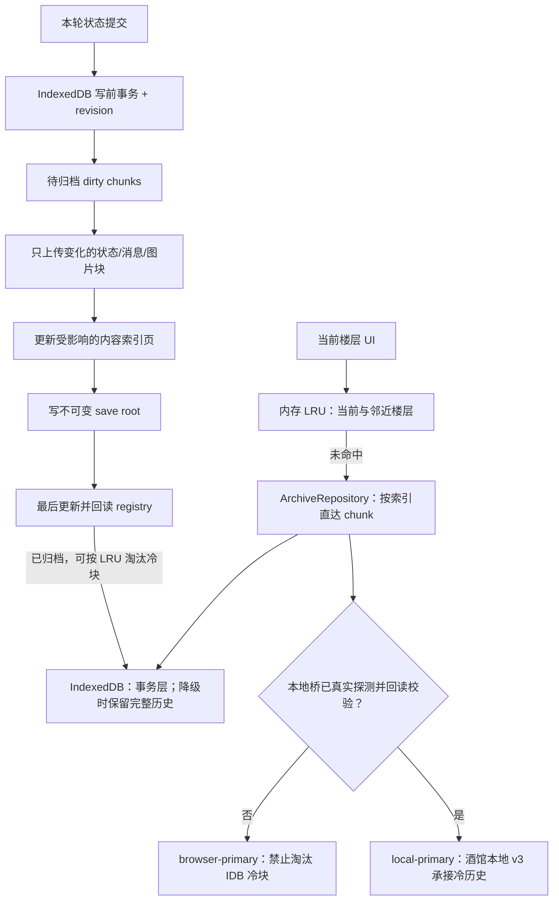

# 本地存档驱动的高楼层性能、TT 兼容与存档迁移：下一窗口实施交接 v0.3（楼层索引修订）

> 日期：2026-07-29
>
> 当前状态：**只读排查与导入脚本的离线可执行检查已完成；未修改业务代码；真实 TT/Tauri、标准 SillyTavern 与玩家存档迁移均未验收。本次修订已按实际玩法冻结“楼层索引 + 楼层前后状态快照”的回看、回滚与正文重生成语义。**
> 下一窗口目标：在保留完整历史、允许用户自由回看任意旧楼层的前提下，先建立可降级的 `ArchiveBackend`。本地桥真实探测成功时，由酒馆本地分块文件承接冷历史；TT/Tauri、桥缺失或桥失败时，由 IndexedDB 完整保留同一套分块历史。两种模式都必须完成数据层真懒加载、增量保存、无黑屏启动、版本迁移、日历目录缓存与图片资产治理。回滚不再设计成通用事件溯源系统，而是以稳定楼层索引、该层用户输入、AI 正文、`beforeTurnState` 与 `afterTurnState` 为直接恢复依据。

## 1. 下一窗口直接执行指令

先完整阅读本文件与仓库 `AGENTS.md`，再开始实施。不要把本文件当作已经运行验证过的结论；其中“已检查”只代表静态代码检查，“推断”必须通过下文的合同测试确认。

实施范围已经明确：可以修改浏览器存储 schema、存档读写接口、本地文件桥协议、图片资产生命周期、世界书目录缓存，以及为这些改动服务的装配代码和测试。不得顺手改剧情正文、世界书内容、prompt 语义、路线规则、数值结算、人物关系或文本重新生成语义。

实施前只建立足够定位问题的失败样本和 I/O 计数，不为本轮额外搭建 Vitest/Jest 等正式测试体系。防丢档、索引直达、增量写入和迁移中断保留少量可重复脚本；标准 ST、TT 桌面、TT 移动、外部图片插件和真实旧档主要交给项目已有玩家测试员实机验收。自动检查只是辅助证据，不代替玩家验收，也不要求把整个非正规项目的既有类型/lint 债清零。

## 2. 用户结果与不可退让的约束

用户会主动翻看很早以前的楼层，因此必须满足：

1. 历史楼层完整保存，不能删除、截断或用摘要替代正文。
2. 可以从第 1000 层直接跳到第 50 层，不从第 1 层线性扫描。
3. 进入存档、保存当前进度、前后台切换的成本不能随历史总楼层数线性增长。
4. 回看旧楼层不触发整份存档重写。
5. 图片按楼层加载；无图存档也必须保持稳定性能。
6. 浏览器存储损坏或被清理后，可以从酒馆本地文件恢复。
7. 本地文件桥暂时不可用时，IndexedDB 必须保留完整分块历史，而不是只保留 dirty journal；游戏仍能保存、重启和翻阅旧楼层，并明确显示“浏览器已保存 / 本地备份待同步或失败”。
8. 任何失败都不得伪装成保存成功、空世界书或空日历。
9. 启用、停用或缺失 `savesolt` 脚本都不得阻断卡片首次渲染；任何能力不足只能降级为“本机归档不可用”。
10. 新版迁移必须先完整验证新 revision 再切换活动指针；旧存档和未来版本存档不得被静默覆盖或降级写回。
11. **本地 JSON 逻辑存档总量不设应用层人为上限。**不得设置最大楼层数、最大消息数、最大归档块数或固定的总字节配额；存档应能持续增长，实际容量只受用户磁盘空间、文件系统与宿主真实能力约束。达到外部物理限制时必须明确报错并保持旧 revision 可恢复，禁止静默删楼、截断正文或用摘要替代历史。
12. 单纯翻看旧楼层只读取该层正文和历史变量快照用于 UI 回显，不得修改当前权威进度、当前存档 revision 或宿主聊天。
13. “回到用户输入”以该楼层的 `beforeTurnState` 为权威：保留该次用户输入，删除该层 AI 正文及其后的未来楼层，并恢复输入前变量。
14. “回到用户输入并自动生成”先完成同一回滚事务，再复用该层保存的用户输入和生成上下文发起新正文；不得把旧 AI 正文继续留在 prompt。
15. 回滚到已完成楼层时保留该层用户输入与 AI 正文，删除其后楼层，并恢复该层 `afterTurnState`。正文重 roll 若发生在非最新楼层，后续楼层必须一起截断，因为它们建立在旧正文之上。

这里的“无上限”是逻辑归档合同，不等于把全部历史塞进一个物理上无限增长的 JSON 文档。不得把任何单文件大小阈值、chunk/pack 大小或浏览器热缓存上限误用成整个存档的总量上限；底层可以并且必须通过小型 root、分页索引和有界不可变 pack 实现逻辑总量持续增长。

## 3. 核心架构决策

### 3.1 本地存档为什么是本轮性能提升的关键

上一版判断容易让人误解成“性能仍靠 IndexedDB，本地文件只负责备份”。本轮冻结的真正方向不是这样。

**本地存档之所以是性能关键，是因为在桥能力已验证的平台上，它可以把已经完成、以后极少修改的旧楼层从浏览器运行对象和浏览器容量压力中移走，封装成不可变文件块。**一旦某个历史块写入酒馆本地文件并由 root/registry 校验成功：

1. 生成新楼层时不再重新规范化、克隆或 stringify 这个旧块。
2. 自动保存时不再重写这个旧块，只写当前 dirty chunk、受影响索引页、当前状态和小 root/registry。
3. 游戏启动时不再把这个旧块读入 IndexedDB Map 或 `uiMessages`；只读取小索引和当前楼层。
4. 用户没有翻到它时，它不占浏览器内存，也不产生 Blob 解码或对象创建成本。
5. 用户确实翻到它时，按楼层号直接读取对应本地 chunk，再放入 IndexedDB/内存热缓存；不读取整份存档。
6. 图片按内容 hash 独立落盘，后续保存不会重复把旧图编码、上传或塞进 JSON。

因此性能变化不是“IndexedDB 换成本地文件”这么简单，而是：

```text
旧结构：历史越长 → 每次加载、保存、备份都重新接触全部历史
新结构：历史落成本地不可变块 → 正常一轮只接触当前变化块
```

如果仍然把所有历史放进一个 `islandmilfcode-backups-v2.json`，本地存档**不会**提升性能；它只有在分块、内容寻址、索引直达、增量提交之后才成为性能关键。

这里必须加一个平台边界：本地文件是**已验证 `local-primary` 模式的性能关键**，但不能成为所有宿主的启动前置依赖。TT/Tauri、旧版 TavernHelper 或未安装桥时进入 `browser-primary`；此时同一套分块、索引和增量算法仍然成立，只是冷块继续完整留在 IndexedDB，禁止淘汰。换言之，性能的结构性根因是“不可变分块不再参与每轮全量处理”，本地文件进一步允许这些冷块离开浏览器热路径和容量边界。

冻结后的权威与职责划分：

- 宿主聊天楼层：剧情记录权威，不能被 iframe 缓存冒充。
- `ArchiveRepository`：应用内逻辑存档权威，向上提供同一套按块读写语义，不让 UI 依赖具体宿主。
- 酒馆本地 v3 文件：仅在 capability probe、写入和回读校验成功后成为完整历史的耐久后端；保存成功的旧楼层、摘要、记忆块和图片可以长期以它为准。
- IndexedDB：始终承担浏览器事务提交；在 `local-primary` 中是写前日志与热缓存，在 `browser-primary` 中则是完整历史后端，绝不能淘汰尚无已验证本地副本的冷块。
- 内存：当前楼层与相邻楼层的有界 LRU，不承担完整历史权威。
- `localStorage`：只保存极小偏好、当前 `saveId`、活动运行标识和迁移标记。

本地桥暂时不可用时，完整历史与新变化都留在 IndexedDB 分块库中，游戏可以继续；桥恢复后只补写尚未归档的内容 hash。只有本地 root/registry 回读校验成功，才能把对应 IDB chunk 标记为已归档，并在超出热缓存上限时安全淘汰浏览器副本。



性能提升的真正根因是“旧历史本地封块后不再参与正常轮次”；分块、索引、增量和禁止无界读取是实现这个结果的必要手段。IndexedDB 仍然重要，但它服务于低延迟提交和缓存，不再背负完整历史的启动、复制与常驻成本。

### 3.2 为什么不能只把 IndexedDB 自身改成分块

只把 IndexedDB 分块当然能改善读取，但仍留下三个问题：

- 浏览器站点数据仍可能被清理或受到 quota/eviction 影响，完整历史没有独立耐久权威。
- 如果全部旧 Blob 和楼层继续永久留在浏览器库中，容量增长和资产治理压力仍在。
- 当前本地桥仍会定时整包导出、stringify、base64 和重传，浏览器主存储变快后仍会被备份路径拖慢。

所以目标分两级：浏览器侧按块提交、索引直达和禁止全量重写是所有宿主必须完成的性能合同；本地侧把确认完成的历史块持久化并允许浏览器只保留热集，是桥可用平台上的耐久与容量增强合同。不得为了追求第二级而让不支持桥的平台黑屏或丢历史。

### 3.3 准确术语

- 当前已经存在的是**显示层懒渲染**，不是完整的数据懒加载。
- “图片重 roll”指外部图片插件或本项目图片按钮触发的图片重生成；没有运行证据时不得声称后端是 ComfyUI。
- 图片重 roll 与正文 `reader-regenerate` 是两条不同链路，不得混用日志或回滚规则。
- SillyTavern 官方所称 Image Swipe 是图片切换/继续生成，不等于真实消息 swipe。

### 3.4 楼层是回看、回滚与正文重生成的最小业务单元

本轮不引入通用事件溯源、任意状态 delta 图或为了理论通用性设计的复杂 snapshot 链。玩家实际操作围绕 Reader 楼层展开，因此存档层直接保存稳定的 `FloorRecord`：

```ts
type FloorRecord = {
  saveId: string;
  floorIndex: number;          // 从 0 开始，存档内稳定且不因缓存窗口变化而重编号
  userMessage: PersistedMessage;
  assistantMessage?: PersistedMessage;
  beforeTurnState: FloorStateSnapshot;
  afterTurnState?: FloorStateSnapshot;
  generationContext?: StoredGenerationContext;
  summaryBoundary: number;
  memoryBoundary: number;
  imageAssetIds: string[];
  revision: number;
};
```

`FloorStateSnapshot` 保存恢复该层真正需要的权威变量，包括 `statusData`、玩家资料、手机状态、绘图设置及与该楼层有关的持久运行字段。它不保存 DOM、弹窗、loading、cancel token、API key、调试结果等瞬时状态。

冻结语义如下：

- **浏览旧楼层**：读取 `assistantMessage + afterTurnState`（没有正文时读取 `userMessage + beforeTurnState`）用于历史 UI 回显；不写入当前运行状态。
- **回到用户输入**：按 `floorIndex` 截断该层 AI 正文和之后的楼层，恢复 `beforeTurnState`，保留该层 `userMessage`。
- **回到用户输入并自动生成**：完成上一条后，复用保存的用户输入与该轮 `generationContext` 重新生成。
- **回滚到完成楼层**：保留目标层，截断其后楼层，恢复目标层 `afterTurnState`。
- **正文重 roll**：等价于“回到该层用户输入并重新生成”；若目标不是最新楼层，后续楼层同时失效并截断。
- **图片重 roll**：只替换目标楼层 `assistantMessage` 的图片 asset 引用并提交新 revision，不恢复变量、不截断正文时间线。

摘要、MemoryDB、手机消息和图片引用必须带稳定 `floorIndex` 或明确覆盖范围。截断时按范围删除/失效，不扫描第 1 层到目标层，也不把“当前只加载了几层”误认为完整历史。

## 4. 当前代码事实与根因

### 4.1 高楼层无图也卡：主因在全量存档路径

| 证据 | 精确位置 | 结论 |
| --- | --- | --- |
| 可见性恢复调用 `reloadFromIdb()` | `state/save-store.ts:131-148` | 每次回到前台都可能全量读取 payload，并清空再重建内存 Map。 |
| 初始化调用同一全量加载 | `state/save-store.ts:216-239` | 启动成本随所有存档 payload 总量增长。 |
| `writePayloadSync()` 先更新内存，再异步排队 IDB | `state/save-store.ts:269-275` | 同步返回不代表事务已经完成。 |
| 上层忽略写入 Promise | `state/saves.ts:770-776` | 自动保存可能在 IDB 失败前就被当作成功。 |
| 每次规范化完整消息数组 | `state/saves.ts:389-420` | 保存成本随消息/楼层总量线性增长。 |
| 每次克隆并重写完整 payload | `state/saves.ts:1084-1124` | `gameState/chatLog/summaryStore/memoryDB` 全量处理。 |
| 自动保存只收到同步 meta 就排本地备份 | `index.ts:511-531` | “已保存”与真实事务完成没有同一提交语义。 |
| 页面隐藏触发异步 flush | `index.ts:4008-4017` | 与重新可见时的全量 reload 存在旧 revision 覆盖新内存的风险。 |

结论：即使完全没有图片，高楼层仍会因完整消息规范化、完整 payload 克隆、全量 IDB 读取和全量备份而卡。图片只是独立放大器。

### 4.2 当前只有显示层懒渲染

| 证据 | 精确位置 | 结论 |
| --- | --- | --- |
| Reader 模型只选当前、前一、后一条 | `render.ts:120-145` | 没有同时渲染所有楼层 DOM。 |
| Reader 消息有数组缓存 | `message-format.ts:630-684` | 已避免部分重复筛选。 |
| 图片标签使用 `loading="lazy"` | `render.ts:249-255` | 浏览器网络/解码层已有基础懒加载。 |

因此本轮不要把 CSS `content-visibility` 或普通 DOM 虚拟化放在第一优先级。必须先处理存储和序列化。

### 4.3 图片资产仍是额外风险

| 证据 | 精确位置 | 结论 |
| --- | --- | --- |
| 启动时 `idbGetAll()` 读取所有 Blob | `state/image-assets.ts:76-88` | 即使当前楼层不显示图片，也会加载完整资产集合。 |
| 有删除未引用资产的函数 | `state/image-assets.ts:238-249` | 目前职责存在，但静态搜索未发现调用方。 |
| 本项目图片重 roll 新建 assetId 后替换旧引用 | `index.ts:2029-2114` | 旧 assetId 没有在新存档提交成功后回收。 |
| 插件请求/响应事件 | `plugins/image-generation.ts:448-565` | 只能证明本项目自定义事件链，不能代表所有外部插件按钮。 |

“页面上没有图”不等于 IndexedDB 里没有孤儿 Blob；性能基准必须分别记录可见图片数、被 payload 引用的图片数、资产表真实记录数和总字节数。

### 4.4 当前本地文件桥是耐久备份，但实现会放大高楼层成本

| 证据 | 精确位置 | 结论 |
| --- | --- | --- |
| 导出当前存档并收集所有引用图片 | `state/saves.ts:1331-1337` | 备份输入仍是完整存档。 |
| 自动备份前拼接完整 JSON 再解析 | `index.ts:612-627` | 产生额外完整字符串和对象。 |
| 自动保存约 12 秒后触发本地备份 | `index.ts:630-650` | 这段窗口内本地文件不含最新 revision。 |
| JSON stringify → UTF-8/base64 → 上传 | `savesolt/IslandMilfCode本机存档桥.js:87-103` | 大文件产生显著内存峰值。 |
| 每次遍历并上传备份所带图片 | 同文件 `269-284` | 未按内容哈希跳过已存在图片。 |
| 读完整 bundle、替换一个 entry、重传、再整包回读 | 同文件 `339-399` | 单一 v2 bundle 随所有存档和历史持续增长。 |

### 4.5 日历消失更像目录读取失败，不是事件状态被删除

| 证据 | 精确位置 | 结论 |
| --- | --- | --- |
| 日历枚举 `state.plotLibrary.events` | `phone/render.ts:676-682` | UI 需要事件定义目录。 |
| `SavePayload` 不包含 `plotLibrary` | `types.ts:71-89` | 存档只保留游戏状态，不保留事件目录。 |
| 世界书 API 缺失/异常被映射为空数组 | `worldbook/index.ts:55-65` | “读取失败”与“合法为空”不可区分。 |
| 单个世界书读取异常被静默跳过 | `worldbook/index.ts:788-836` | 全部失败会返回空目录。 |
| 仅在内存旧目录非空时保留旧值 | `index.ts:772-807` | 新挂载时旧目录为空，保护无效。 |
| 进入存档先 render，后异步刷新世界书 | `index.ts:1059-1123` | 重挂载或插件触发刷新后可先显示空日历。 |
| `syncMainEvents` 不因空目录删除普通状态 | `variables/normalize.ts:413-460` | 更可能是目录缺失造成 UI 空，而非已发生事件状态被删除。 |

推断链路：外部图片插件重 roll 可能触发宿主消息更新或同层重挂载；新运行实例在世界书瞬时读取失败时得到空 `plotLibrary`；日历因为没有目录而空。此链路必须用真实宿主日志验证，不能直接归因给 ComfyUI。

### 4.6 TT/Tauri 启用 `savesolt` 黑屏：必须按发生时机分流

已排除一个方向：导入 JSON 不是截断或转义错误。`savesolt/导入到酒馆中/IslandMilfCode本机存档桥.json:4` 的 `content` 与 `savesolt/IslandMilfCode本机存档桥.js` 精确相等，均为 19,168 字符；两份脚本都通过语法检查。桥自身也没有 DOM/CSS 操作。

| 黑屏时机 | 已有证据 | 下一窗口判定方式 |
| --- | --- | --- |
| 点击启用后立刻发生 | `savesolt/IslandMilfCode本机存档桥.js:540-542` 在 `eventOn/eventEmit` 缺失时顶层 `throw`；离线 VM 已执行并稳定得到 `[IslandMilfCode Saves] 酒馆助手事件接口不可用`。`544-553` 的旧订阅停止和新订阅注册也没有外层故障隔离。 | 先看控制台第一条 uncaught error，并记录 `typeof eventOn/eventEmit/SillyTavern/TavernHelper`；桥启动必须改成 no-throw、等待宿主 ready、超时后 fail-soft。 |
| 进入存档或约 12 秒自动备份时发生 | 当前桥在 `76-103,269-399` 读取整包、构造多份 JSON/UTF-8/binary/base64/外层 JSON、上传全部引用图，再整包回读；调用侧 `index.ts:612-628` 还先 `join` 整份导出再 `JSON.parse`。 | 记录 bundle 字节、GET/POST 耗时和 WebView 内存；用 0/1/8/15/17 MiB 与 100/1000 层无图矩阵复现，不能只用空新档。 |
| 没有桥脚本也黑 | `index.ts:3987-4027` 在首次 `render()` 前 `await initSaveStore()`；`state/save-store.ts:232-236` 捕获 IndexedDB 初始化错误后仍重新抛出，入口无恢复 UI。 | 控制台若是 `indexedDB.open/upgrade/blocked/quota`，属于卡本体初始化故障，不是桥脚本故障；必须显示可恢复错误页。 |

截至公开主仓库 HEAD `4a500879` / package `2.1.1`，TauriTavern 已实现当前桥使用的 `/api/files/upload` 和 `/api/images/upload`，并拦截 `fetch`/jQuery AJAX。因此不得笼统归因成“TT 不支持这些接口”。但该版本移动端读取 `user/files` 的单文件内联上限是 16 MiB，超限明确返回 `File is too large to load on mobile.`；读取还会把整文件再次 base64 经 IPC 返回。当前单一 `islandmilfcode-backups-v2.json` 可能先写成功、随后在 `savesolt/...桥.js:389` 的整包回读校验处失败；低于 16 MiB 也可能因多份拷贝假死。

所以 v3 桥的兼容合同是：启动永不顶层抛错；先等待稳定宿主 ABI ready，再做真实读写能力协商；manifest/root 保持很小，正文块建议 256 KiB～1 MiB 且任何单文件远低于 16 MiB；图片内容寻址并独立保存；恢复按需读取，禁止 `Promise.all` 全资产；脚本、文件 transport、数据库和 UI 分属不同故障域。

### 4.7 当前变量到底哪些会保存

当前并不是整个 `AppState` 都保存。真正的单存档载体是 `SavePayload`（`types.ts:79-89`）；宿主消息的 `stat_data` 只是 `StatusData` 镜像，不是完整恢复源。

| 分类 | 当前会保存 | 当前不会随单存档保存/会重建 |
| --- | --- | --- |
| 核心世界与角色变量 | `statusData`：时间、地点、当前主事件、主事件状态、触发次数、目标角色好感/执念/阶段/称号/服装/meta、当前目标 ID、背包。另通过 `variables/adapter.ts:27-94` 镜像到宿主 `stat_data`。 | `recentEvents` 在 `variables/legacy.ts:98-113` 每次 normalize 被清空；`activeTargetId` 在 `154-168` 被强制改成 `null`，所以这两项目前事实上不能可靠跨存档恢复。 |
| 玩家与功能状态 | `index.ts:495-508` 把 `playerProfile`、`phoneMessages`、`drawingSettings` 和几乎整个 `runtimeFlags` 放进 `gameState.runtimeFlags`。 | `deepSeekMode/deepSeekWebLookup` 被 `index.ts:484-487` 和 `state/saves.ts:422-442` 删除；浮动手机位置、DeepSeek 模式、摘要 API 配置、active save/run ID 是独立 localStorage，不属于单档。 |
| 正文与回滚 | user/assistant 消息的 id、角色、speaker、text、rawText、插图引用和精简 `statusSnapshot`。 | system、streaming 标记、tavernMessageId 不保存；当前翻阅楼层也不保存，`currentMessageIndex` 实际写最新 Reader 楼层。 |
| 手机聊天 | 线程、消息、未读数、worldTime、floorIndex、draft，以及当前实现中的 `generating`。 | pending/cancel 过程没有可靠边界；恢复时不应继续旧生成任务。 |
| 摘要与长期记忆 | `summaryStore`、完整 `memoryDB` 及其 extensions；图片 Blob 在独立 IDB store，本地备份再收集被引用 asset。 | MemoryDB `_indexes` 应重建；世界书 `plotLibrary`、`characterCardLibrary`、音乐和多数 UI/编辑/通知/后台任务状态不在 payload。 |
| 兼容字段 | 类型、导入和读取支持 `messageSnapshots`；类型和 normalizer 支持 `GameState.worldState`。 | 普通保存 `state/saves.ts:1101-1109` 不带 `messageSnapshots`；`buildGameState()` 不带 `worldState`，所以下次自动保存会把两者丢掉。 |

已确认的字段漏洞也必须进入迁移 fixture：

- 插图 `rerollContext.negativePrompt` 在 `state/store.ts:154-169` 被保留，但在第二次规范化 `state/saves.ts:71-85` 被漏掉。
- `PlayerProfile.gender` 的当前 normalizer 无法可靠保留原值（`state/saves.ts:139-226`）。
- `runtimeFlags` 现在采用“复制全部、只删两个键”的 denylist，会意外保存 cancel token、pending phone、generation debug、搜索结果/API key、`phoneMessages.generating`、`saveRecoveryNotice` 等瞬时或敏感状态。
- 手机 `draft` 和 `generating` 都被 `state/store.ts:303-358` 原样恢复；v3 应保留玩家草稿，但加载时强制 `generating=false` 并清掉 pending/cancel token。
- `plotLibrary` 不在存档，所以世界书读取失败会让日历目录空；这不等于 `statusData.world.mainEvents` 的事件状态丢失。

v3 必须用显式字段分类取代任意 `Record<string, unknown>`：`authoritative-save`、`host-mirror`、`global-preference`、`derived-cache`、`ephemeral`。运行时字段采用 allowlist；未知旧字段进入 `legacyExtras`/原始源引用，不得在迁移中静默抛弃。

### 4.8 当前版本迁移为什么不安全

| 证据 | 精确位置 | 风险 |
| --- | --- | --- |
| 卡版本 `0.43` 直接等于存档 schema | `version/index.ts:1-5` | 每次内容/UI 发版都被误当成数据结构迁移；IDB、MemoryDB、本地格式和桥协议版本也没有独立治理。 |
| 读档时全量 normalize 并覆盖原 payload | `state/saves.ts:784-885` | 读操作有写副作用，没有逐版本 migrator、迁移日志或回滚点。 |
| 任意 `payload.version !== SAVE_VERSION` 都回写 `0.43` | `state/saves.ts:852-874` | 老客户端会把未来 schema 降级覆盖并丢未知字段。 |
| v1 聚合迁移 fire-and-forget 后立刻删源 | `state/saves.ts:676-722` | IDB 失败或中断时可能丢唯一旧源。 |
| localStorage → IDB 只要迁成功任意记录就删全部旧 payload key | `state/save-store.ts:159-205` | 解析/写入失败的其他 key 也会被删除；index 与 payload 不在同一事务。 |
| 单档/全量导入的图片写入不等待，payload/index 也非同一事务 | `state/saves.ts:1344-1465` | 可产生“存档可见但图片或 payload 未完成”的半迁移状态。 |

下一轮先拆开：`CARD_VERSION`、`SAVE_DATA_SCHEMA_VERSION`、`IDB_SCHEMA_VERSION`、`MEMORY_DB_SCHEMA_VERSION`、`LOCAL_ARCHIVE_FORMAT_VERSION`、`BRIDGE_PROTOCOL_VERSION`。未来版本存档只能列出、导出或只读打开，禁止 normalize 和写回。

迁移必须按 save 独立执行：冻结并 hash 旧源 → 解析但保留 raw/未知字段 → 生成固定 chunk 计划 → 在新 IDB stores 分批幂等写入 → 核对消息/楼层/变量/MemoryDB/图片计数和 hash → 单事务发布 browser root/active pointer → 本地桥可用时复制 chunks/index/root → 最后发布并回读 registry → 仅在确认本地 revision 后允许淘汰 IDB 冷副本。桥不可用时停在 `LOCAL_PENDING`，但 browser v3 已是完整可运行存档；旧 v1/v2 源始终保留。

## 5. 目标数据模型

禁止继续把一个存档作为单个巨大 `SavePayload` 运行。数据模型必须通过 `ArchiveRepository` 分成“浏览器事务/归档层”“可选本地完整历史层”和“内存热层”。命名可以依照仓库约定微调，但职责不得重新合并，UI 也不得直接判断具体 transport。

### 5.1 浏览器热层：写前日志与缓存

| Store | Key / Index | 内容 |
| --- | --- | --- |
| `save_meta` | `saveId` | 名称、runId、当前绝对消息 seq、当前 reader floor、版本、browserRevision、本地归档 revision。 |
| `save_state` | `saveId` | 有界当前世界状态；不得嵌入完整消息、图片 Blob 或其他无界历史集合。 |
| `floor_records` 或 `floor_chunks` | `[saveId, floorIndex]` 或 `[saveId, chunkNo]` | 未归档 dirty 楼层与最近访问热块；每层直接包含 user、assistant、`beforeTurnState`、`afterTurnState`、生成上下文引用和资源引用。建议每块 16～32 层。 |
| `floor_index` | `[saveId, pageNo]` | 轻量分页索引：reader floor → chunk、messageId、状态快照是否完整、摘要边界、是否有图；不得含正文或完整变量对象。 |
| `summary_rows` | `[saveId, id]` | dirty 或热缓存的 minor/major/global 摘要行和覆盖范围。 |
| `memory_rows` | `[saveId, table, rowId]` | dirty 或热缓存的 MemoryDB 行与索引；变更通过 upsert/dirty row 提交。 |
| `image_assets` | `assetId` | 新生成未归档图片与最近访问 Blob；按 key 读取并有界缓存。 |
| `worldbook_cache` | `[characterKey, worldbookSetHash]` | 最近一次成功解析的 targets、plotLibrary、角色卡目录及来源版本。 |
| `backup_journal` | `[saveId, revision]` | 待同步到本地文件的 dirty chunks、资源 hash、重试状态。 |

IDB 冷块淘汰必须同时满足：当前后端状态是 `local-primary`、本地 root/registry 已确认包含该 hash、当前没有事务/journal 引用、不是当前/相邻/最近访问热块。`browser-primary` 模式禁止淘汰完整历史块。淘汰只是释放浏览器副本，不删除本地历史。

### 5.2 可选本地完整历史层：不可变块与小型根清单

进入 `local-primary` 后，本地 v3 必须包含恢复完整存档所需的全部权威块：楼层记录、当前状态、摘要、MemoryDB、图片与版本化索引。完成的历史块不可原地修改；发生编辑、回滚或正文重 roll 时写新块并由新 root/registry 切换引用，旧 revision 至少保留到新 revision 验证成功。未进入该模式时，相同逻辑记录保留在 IDB v3 stores，不能假装已经本地归档。

本层对外表现为一个**总量不设人为上限的 JSON 存档**：新增历史只会增加新的 pack/index page 或发布新的 root revision，不得因为累计楼层、累计消息或累计 JSON 字节达到某个产品内阈值就拒绝继续保存。物理文件仍保持有界；“逻辑总量无上限”和“单文件有界”必须同时成立，前者保证玩家可以长期保存全部历史，后者保证读取、解析和写入成本不会退化为全档 `O(N)`。

存档 root 不应直接无限列出所有楼层。使用固定 chunkSize 和分页索引：

```text
save root
  -> 当前 state/checkpoint 引用
  -> chunkSize、messageCount、floorCount、currentRevision
  -> floor index page 引用（每页管理例如 128 个 chunk）
  -> summary/memory index page 引用
  -> image content-hash 索引页
```

这样启动只读 root、当前 checkpoint、当前楼层对应的索引页与 chunk；跳到第 50 层时可根据 `floor/chunkSize/indexPageSize` 直接定位，不需要先下载全部历史目录。

如果一次性拆分 `summaryStore` 与 `memoryDB` 风险过高，允许先把它们各自做成独立、按 dirty hash 写入的块；但每条记录必须带楼层范围，以便回滚时按范围截断。最终验收不允许保存当前楼层时重新克隆完整 `chatLog`，也不允许本地同步重新拼接完整历史。任何仍随楼层数增长的集合必须明确记录，不能宣称总体已经稳定。

## 6. 楼层读取与回看合同

建立专门的楼层 repository，避免继续让 `index.ts`、渲染器或生成动作直接理解 IDB/本地文件结构。至少提供：

- `getFloor(saveId, floorIndex)`：按索引直接读取目标 `FloorRecord`。
- `getFloorWindow(saveId, floorIndex, radius)`：读取当前与相邻楼层。
- `appendFloor(...)`：以同一逻辑 revision 提交用户输入、AI 正文、前后状态和索引。
- `replaceFloorAssistant(...)`：编辑正文或图片引用时只写所属 floor/chunk；图片重 roll 不改变状态快照。
- `truncateFromAssistant(saveId, floorIndex)`：保留该层用户输入，删除该层 AI 正文及后续楼层，并恢复 `beforeTurnState`。
- `truncateAfterFloor(saveId, floorIndex)`：保留目标完成楼层，删除后续楼层，并恢复 `afterTurnState`。
- `regenerateFloor(saveId, floorIndex)`：先执行 `truncateFromAssistant`，再返回保存的用户输入与生成上下文供 action 层重新生成。
- `getPromptContext(...)`：只返回当前生成真正需要的最近楼层和摘要范围。
- `streamAllForExport(...)`：导出/迁移时分块遍历，不要求常驻内存。

默认建议：

- 首次进入只 hydrate 当前楼层、前后各 2 层，以及生成链实际要求的最近上下文；缓存未命中时从当前 `ArchiveBackend` 的索引页和对应 chunk 读取。
- 内存 LRU 保留最近访问 10～20 层；只淘汰内存对象，不删除持久记录。
- 连续向前翻时预取更早 2 层，连续向后翻时反向预取。
- 任意跳转通过 `floor_index`/分页索引直接定位当前 backend 的 chunk；不能为了找到目标层下载完整 manifest 明细或遍历前序 chunk。
- `floorIndex`、messageId、summary/memory 覆盖范围继续使用稳定绝对序号；不得因 LRU 窗口变化重新编号。
- 历史变量面板从目标层的 `afterTurnState` 回显；用户只翻页时不得把它写回 `state.statusData`。只有确认回滚或重生成后，repository 返回的新权威状态才写入当前运行态。
- prompt、摘要、回滚和正文重生成调用方不得假定“当前已 hydrate 数组就是完整历史”。
- `AppState.uiMessages` 可以在过渡期继续作为当前窗口的 UI 模型，但其长度不再代表总楼层数；总数、首尾、跳转和回滚边界都来自 repository/meta。

## 7. 写入与 revision 合同

### 7.1 一个保存动作的真实提交顺序

1. 为本轮生成单调递增 `revision`。
2. 在同一 IndexedDB readwrite transaction 内提交变更的 `FloorRecord`（用户输入、AI 正文、`beforeTurnState`、`afterTurnState`）、当前状态、摘要/记忆行、楼层索引、meta revision 和对应 backup journal；避免正文与变量快照分离，也避免浏览器提交成功后因崩溃遗漏本地同步任务。
3. 等待 transaction `complete`；在此之前 UI 不得报告“浏览器存档成功”。
4. transaction 完成后根据 capability 状态处理 `backup_journal`：`local-primary` 调度本地同步；`browser-primary` 保留 pending 记录但不阻塞本轮保存。
5. 仅在本地 backend 可用时，所有变化块上传并校验后，依次提交受影响索引页和不可变 save root，最后更新 registry 指针。
6. registry 回读并沿 root 验证 revision/hash 后，更新 `localBackedUpRevision`，显示“本地完整历史已落盘”；对应旧 IDB 块此后才有资格按 LRU 淘汰。

IDB 提交失败：保留 dirty 状态、显示可见错误、不得排本地备份为成功。

本地备份失败：浏览器 revision 仍有效，保留 journal 重试、显示两层状态差异。
本地上传完成而 registry/root 回读失败：不得猜测成功，保留旧 registry/root 为权威并进入可重试状态。

楼层截断与正文重生成必须复用同一 revision 规则：先发布不含旧 AI 正文/未来楼层的新 browser revision，再允许 action 层发起生成；生成成功后以更高 revision 补齐新 `assistantMessage` 与 `afterTurnState`。生成失败时停留在“用户输入已保留、AI 正文为空、变量为 `beforeTurnState`”的可继续状态，不能恢复旧 AI 正文冒充成功。

### 7.2 前后台竞态

- 页面隐藏时的 flush 与重新可见时的 reload 必须共享 revision/队列屏障。
- 可见性恢复不得 `clear()` 当前 dirty/newer 内存后灌入旧 revision。
- 规则：`incomingRevision < memoryRevision` 必须拒绝；相等可去重；更高 revision 才允许替换。
- 多标签 BroadcastChannel 也使用相同 revision 规则。
- 不再用“全量 reload 所有 payload”兜底；只刷新 index/meta 和活动存档必要记录。

### 7.3 浏览器存储健康

- 在支持时调用 `navigator.storage.persist()`，记录结果但不把拒绝视为致命错误。
- 使用 `navigator.storage.estimate()` 记录 usage/quota；接近阈值时提供可见提示。
- 捕获并区分 `QuotaExceededError`、事务 abort、桥不可用、校验失败。
- 不引入 localStorage 大对象回退。

## 8. 酒馆本地文件 v3 协议（能力探测通过时启用）

### 8.1 文件组织

不要覆盖 v1/v2；新增 v3 并保持读取兼容。建议：

```text
user/files/islandmilfcode-v3-registry.json
user/files/islandmilfcode-v3-root-<saveToken>-<hash>.json
user/files/islandmilfcode-v3-floor-index-<saveToken>-<pageNo>-<hash>.json
user/files/islandmilfcode-v3-state-<saveToken>-<hash>.json
user/files/islandmilfcode-v3-floor-<saveToken>-<chunkNo>-<hash>.json
user/files/islandmilfcode-v3-summary-index-<saveToken>-<pageNo>-<hash>.json
user/files/islandmilfcode-v3-summary-<saveToken>-<chunkNo>-<hash>.json
user/files/islandmilfcode-v3-memory-index-<saveToken>-<pageNo>-<hash>.json
user/files/islandmilfcode-v3-memory-<saveToken>-<chunkNo>-<hash>.json
user/images/islandmilfcode-assets-<saveToken>/<contentHash>.<ext>
```

`registry` 只保存存档列表、简要 meta 和各存档当前 root hash；每个不可变 root 指向分页索引，分页索引再指向内容 chunk。这样正常启动不读取所有正文，单个存档增长也不会迫使每次重写其他存档。

如果 `/api/files/upload` 不允许目录分隔符，JSON chunk 继续使用安全的扁平文件名；图片沿用原生图片接口目录。不要为了根目录整洁再次退回单一巨大 bundle。

### 8.2 内容寻址与提交

- chunk、索引页和 root 文件名包含内容 hash；同 hash 已存在时不重复上传。
- 一次只上传 dirty chunk 和新图片；未变化图片上传数必须为 0。
- 提交顺序为：dirty 内容块 → 受影响的索引页 → 新 root → 最后更新 registry 指针；registry 更新是本地归档提交点。
- root 至少包含格式版本、saveId、runId、revision、计数、chunkSize、索引页引用、状态引用、资源索引引用和提交时间。
- registry 上传后必须回读，并沿当前 root 校验 revision、受影响索引页和 dirty chunk hash。
- 新 registry/root 失败时旧 registry/root 仍可完整恢复，不能先覆盖/删除旧块。
- 垃圾回收延后到新 registry/root 已验证且至少保留一个可恢复 revision 之后；本轮不得冒险删除唯一 v2 备份。

### 8.3 兼容与降级

- 后端状态至少区分：`unknown`、`probing`、`browser-primary`、`local-v1`、`local-v3`、`no-event-api`、`no-responder`、`backend-unsupported`、`temporarily-failed`；不能再用“有 event API”这个布尔值冒充桥可用。
- 读取顺序由已提交 active pointer 决定；发现旧源时依次识别 IDB v3、local v3、v2 bundle、v1 legacy，但未验证的新副本不得抢先覆盖旧活动源。
- v1/v2 恢复后，先在 IDB 完成迁移事务并验证，再异步写 v3；不得自动删除旧文件。
- 没有安装本地桥、TT host 尚未 ready 或 bridge probe 失败时，IDB v3 完整保留全部历史并显示“本地备份未启用/待同步”；仍允许手动 JSON 导出。
- 桥 IIFE 必须有最外层故障隔离，缺 API 或订阅失败只记录 capability unavailable；不得顶层 `throw`。Tauri 环境需等待公开 host ready 契约，不能直接调用内部 Tauri command。
- JSON chunk 建议 256 KiB～1 MiB，任何单文件必须远低于 TT 移动端 16 MiB 内联读取限制；列表、写入、校验和恢复都不得重新拼成单一大 bundle。
- `probe` 必须验证 responder、协议版本、实际小文件写入、回读内容 hash 与清理策略；`isTavernFileBackupAvailable()` 只检测事件函数不算成功。
- 本地 registry/root 可读取但某块损坏时，报告具体 index page/chunk/hash，不返回半份存档。
- `savesolt/IslandMilfCode本机存档桥.js` 修改后，必须同步 `savesolt/导入到酒馆中/IslandMilfCode本机存档桥.json` 中的脚本镜像，并更新对应 README。

## 9. 日历与世界书目录可靠性

`plotLibrary` 是世界书派生目录，不应复制进每次游戏存档，但必须有独立的最近成功缓存。

实现要求：

1. `loadCharacterWorldbookData()` 返回明确状态：`success`、`legitimate-empty`、`api-unavailable`、`partial-failure`、`total-failure`；不要把异常全部折叠为 `[]`。
2. 用当前角色标识和绑定世界书集合 hash 作为缓存 key。
3. 进入存档时先读取最近一次成功缓存，再首次 render；之后后台刷新。
4. 后台读取成功且合法为空时可以更新为空；API 不可用或读取失败时保留缓存并显示非阻断提示。
5. `statusData.world.mainEvents` 的状态与 `plotLibrary.events` 的定义职责继续分离。
6. 宿主 `WORLDINFO_UPDATED` 只使缓存失效并触发受控刷新，不直接清空目录。

必须验证“成功一次后连续失败五次”仍能显示事件，以及“世界书确实被解绑/清空”最终能合法变为空。

## 10. 外部图片插件与宿主生命周期

新增独立生命周期模块，例如 `actions/host-lifecycle.ts`，不要继续把宿主事件业务塞进 `index.ts`。

需要监听并结构化记录 SillyTavern 可用的：

- `MESSAGE_UPDATED`
- `MESSAGE_SWIPED`
- `CHAT_CHANGED`
- `WORLDINFO_UPDATED`

约束：

- 宿主事件只用于诊断、缓存失效和必要的受控回读。
- 不得从任意 `MESSAGE_UPDATED` 推断用户进行了正文回滚。
- 图片插件自己的 reroll/Image Swipe、本项目 `generate-image-request/response`、正文 `reader-regenerate` 必须使用不同 operation id 和日志标签。
- 只有本项目真正收到 `generate-image-response` 并替换 assetId 时，才适用本项目图片引用/GC 提交逻辑。
- 正文 `reader-regenerate` 必须走楼层 repository 的 `truncateFromAssistant/regenerateFloor`；不能只改内存数组，也不能把图片 reroll 的资源替换当作正文时间线回滚。
- 外部插件若只修改宿主消息，应验证重挂载后 `plotLibrary.events`、`mainEvents`、活动 save revision 均未倒退。

## 11. 图片懒加载与安全回收

1. `initImageAssetStore()` 不再 `getAll()` Blob；启动只加载资产元数据或不加载资产。
2. `getImageAsset(assetId)` 按 key 异步读取，创建 object URL 后进入有界 LRU。
3. Reader 当前楼层 hydrate 后再请求该层图片；预取范围必须小且可配置。
4. 图片重 roll 流程：先写新资产 → 只提交目标 `FloorRecord.assistantMessage` 的新 assetId/revision → 成功后才允许降低旧资产引用；不恢复 `beforeTurnState`，也不截断后续楼层。
5. 引用扫描必须覆盖所有存档、当前未提交 revision、v3 registry/root 保留 revision、玩家头像和迁移中数据。
6. GC 只能删除引用数为 0 且不在 pending transaction/journal 中的资产。
7. `URL.revokeObjectURL()` 与 IDB 删除分开处理，任何一个失败都必须可重试。
8. 图片重 roll 的正常成本应与历史总图片数无关；不得每次扫描或上传全部图片。

## 12. 精确修改范围

### 12.1 预计修改

| 文件/目录 | 主要改动 |
| --- | --- |
| `version/index.ts:1-5` | 解耦卡版本、逻辑存档 schema、IDB schema、本地归档格式与桥协议；未来版本设置明确只读闸门。 |
| `state/idb.ts:4-87` | 升级 schema、跨 store 事务辅助、按 key/range/cursor API，禁止业务层依赖无界 `getAll()`。 |
| `state/save-store.ts:131-293` | meta/index 与 payload 拆分、迁移 journal、revision 屏障、真实 Promise 提交语义、可见性恢复去全量 reload；修正 `159-205` 删除失败旧 key 和 `232-236` init 重抛导致黑屏。 |
| `state/saves.ts:61-85, 676-885, 1084-1137, 1208-1465` | 拆成无副作用 decoder、显式 migrator 和事务导入；修复 future downgrade、旧源早删、reroll `negativePrompt`、`messageSnapshots/worldState` 静默丢失；移除正常保存的完整 chatLog 规范化/克隆。 |
| `types.ts:19-37, 71-166, 366-381, 463-504` | 区分运行时类型、v1/v2 legacy source、v3 `FloorRecord`/provenance、持久/派生/瞬时字段；保留绝对 floor/message 语义、楼层前后状态和未知扩展。 |
| `variables/legacy.ts:85-113, 154-168` | 明确 `recentEvents`、`activeTargetId` 的持久化合同；若仍要规范化清空，必须作为显式、有测试的迁移规则而非静默丢字段。 |
| `state/store.ts:154-169, 303-358, 884-1085` | 与 save decoder 使用同一 reroll/phone schema；保留 negativePrompt，恢复时终止旧 generating/pending 状态；把依赖完整 `uiMessages` 扫描的回滚改为调用楼层 repository，并区分历史回显与权威恢复。 |
| `state/tavern-file-backup.ts:45-180` | 用真实 capability negotiation 取代 `90-93` 的事件函数布尔判断；区分无 API、无 responder、协议不兼容、暂时失败和 local v3。 |
| `index.ts:511-689, 772-807, 1059-1123, 2029-2114, 3987-4027` | 只保留装配；等待事务提交、显示 backend/migration 状态、调用 repository/缓存/生命周期模块；初始化失败也必须进入可恢复 UI。 |
| `message-format.ts:630-690, 1379-1495` | 适配分页 repository 和稳定绝对索引；prompt 只消费 repository 返回的最近上下文与摘要，不得把 hydrate 窗口误作完整历史。 |
| `render.ts:120-145, 235-255` | 只做当前楼层/相邻预览的异步加载状态，不承担持久化。 |
| `index/reader-ui.ts` | 翻页、按 id 定位和总楼层数改读 repository/meta；只翻页不得改写当前权威变量。 |
| `actions/index.ts`、`actions/opening.ts`、`actions/streaming.ts` | 生成链只操作当前楼层窗口；正文重 roll 统一走“恢复 `beforeTurnState` → 截断 → 复用用户输入/上下文生成”，图片重 roll 保持独立。 |
| `summary/run.ts`、`summary/repair.ts` | 按绝对楼层范围读取必要正文；截断后按范围清理摘要，不依赖内存数组长度判断历史是否存在。 |
| `state/image-assets.ts:76-88, 238-249` | Blob 按 key 加载、元数据/LRU、引用计数或安全 GC。 |
| `worldbook/index.ts:55-65, 788-836` | 返回可区分的加载结果与错误诊断。 |
| `phone/render.ts:676-682` | 如有必要显示“使用缓存/刷新失败”状态；不自行创造事件。 |
| `plugins/image-generation.ts:448-565` | 仅补 operation id/诊断所需信息，不改变生成 prompt 或后端假设。 |
| `savesolt/IslandMilfCode本机存档桥.js:4-16, 76-103, 186-259, 269-420, 513-556` | v3 registry/root/index-page/chunk/hash、增量上传、回读验证、v2/v1 兼容；移除单包/全图片并发；启动 no-throw、等待 ready、pagehide 清理、响应发送故障隔离。 |
| `savesolt/导入到酒馆中/IslandMilfCode本机存档桥.json` | 与 JS 源同步。 |
| `savesolt/导入到酒馆中/README.md` | 更新 v3 文件布局、兼容和恢复说明。 |

### 12.2 建议新增模块

- `state/floor-repository.ts`
- `state/archive-backend.ts`
- `state/browser-archive-backend.ts`
- `state/tavern-archive-backend.ts`
- `state/save-migration.ts`
- `state/save-codecs.ts`
- `state/save-revision.ts`
- `state/backup-journal.ts`
- `state/worldbook-cache.ts`
- `actions/host-lifecycle.ts`
- `scripts/simulate-save-performance.ts`
- 对应的最小合同测试文件

文件名可以依仓库约定调整，但 `index.ts` 只能装配、初始化、生命周期和渲染调度，不能承接新的存储业务实现。

### 12.3 明确不动

- 剧情卷、事件文本、世界书条目内容。
- prompt 主结构、模型指令和生成文本协议。
- 路线开关、事件日期、数值、关系与结算规则。
- 正文 prompt、模型指令和玩家看到的生成结果语义不变；允许把回滚/重生成的调用方式改为本文件冻结的楼层索引流程，但不得额外改写剧情或数值规则。
- 不因本轮需求引入 OPFS 作为新的第四套主存储；先把现有 IDB + 本地桥做好。
- 不自动删除 v1/v2 唯一备份或用户文件。

## 13. 最小防丢档检查与玩家测试清单

本项目不为本轮新建正式单元测试框架，也不要求通过全仓既有类型/lint 检查后才能进入玩家测试。实现者只需提供少量可重复脚本或调试入口，证明没有走回全量读写、索引回滚不会丢正文/变量、旧档迁移失败可恢复。真实宿主兼容、交互观感和长时间游玩由项目玩家测试员验收。

### 13.1 性能与 I/O 合同

准备 `100 层无图` 与 `1000 层无图` 两个最小模拟档；图片性能主要由玩家真实档验证，出现问题时再补针对性脚本。脚本至少能记录 IDB 记录读取数、Blob 读取数、本地上传文件数与字节数。

1. **进入 1000 层存档**：只读取 meta/root、当前状态、当前索引页和当前±2 层，不读取全部正文或全部 Blob。
2. **第 1000 层跳第 50 层**：通过 `floor_index` 直达目标 index page/chunk；不能从第 1 层扫描，也不能先加载 950 层正文。
3. **保存当前层**：只写当前 `FloorRecord` 所属 chunk、当前状态、受影响索引和 meta/journal；不 stringify 或克隆完整 chatLog。
4. **翻看旧楼层**：变量面板显示该层 `afterTurnState`，但当前权威状态和 revision 不变。
5. **正文重 roll**：恢复该层 `beforeTurnState`，删除旧 AI 正文；选择自动生成时复用该层用户输入。非最新层重 roll 必须截断后续楼层。
6. **图片重 roll**：只替换图片引用，不恢复变量、不截断正文楼层，未变化图片上传数为 0。
7. **本地归档与桥离线**：本地确认后可按需淘汰 IDB 冷块；桥离线时 IDB 仍保留完整历史，恢复后只补传未归档 hash。

### 13.2 正确性与恢复合同

1. 选取至少一份真实 v2 玩家档迁移到 v3，核对楼层数、用户输入、AI 正文、楼层变量回显、图片、摘要与 MemoryDB；原 v2 保持可读且不删除。
2. 人为在迁移中途停止一次，重新进入后必须继续或回到旧档，不能出现半份活动存档。
3. IDB 提交失败时 revision 不前进；IDB 成功而本地桥失败时游戏继续、journal 保留、状态明确显示。
4. 浏览器存储被清空后，本地 v3 能按楼层恢复；单块损坏时明确指出损坏位置，不生成半份存档。
5. hidden flush 与 visible reload 交错时只接受最大已提交 revision。
6. future schema 只允许列出、导出或只读打开，旧客户端不得写回。
7. 旧字段重点抽查 `negativePrompt`、gender、activeTargetId、目标 meta、背包、phone draft/unread/floorIndex、MemoryDB extensions；`generating`、cancel token、pending/API key 不恢复成活动任务。

### 13.3 日历与插件合同

1. 世界书成功读取一次后连续失败五次，日历事件仍来自最近成功缓存。
2. 世界书 API 成功返回合法空绑定时，缓存可以被明确清空。
3. `plotLibrary.events` 暂时不可读时，`statusData.world.mainEvents` 不被删除或重置。
4. 外部图片插件触发 `MESSAGE_UPDATED`/重挂载后，活动 save revision 不倒退，日历目录不无提示变空。
5. 本项目 `generate-image-response`、外部 Image Swipe、正文 `MESSAGE_SWIPED` 分别记录，不互相触发错误回滚。

### 13.4 消息污染与回滚合同

1. `lastSummarizedIndex` 只前进；仅在超过实际绝对消息总数时纠正。
2. 分页/LRU 淘汰不能让旧正文重新进入 prompt，也不能让摘要把“未加载”误判成“消息不存在”。
3. 只翻看旧楼层时，prompt、当前状态和 active revision 均不改变；历史变量仅用于 UI 回显。
4. 正文重生成使用目标层保存的用户输入和生成上下文，先恢复 `beforeTurnState` 并去掉旧 AI 正文；旧正文不得重新进入 prompt。
5. 回滚到用户输入时保留用户消息；回滚到完成楼层时保留该层 assistant。两者都按稳定 `floorIndex` 截断未来楼层、摘要/记忆行和图片引用，失败时不出现半截状态。

### 13.5 TT/Tauri 黑屏与变量边界合同

1. 玩家测试员在标准 SillyTavern、TT 桌面和 TT 移动端分别启用桥、进入存档、等待自动备份并重新进入；桥缺失、host 未 ready 或无 responder 都不得阻断首次 render。
2. 黑屏按“启用后立刻、进入存档、自动备份后”分别记录控制台第一条错误，不把不同故障统一归因给 TT 或图片插件。
3. v3 任意 JSON chunk 都远低于 TT 移动端单文件限制；超过宿主真实限制时显示可恢复错误，不能黑屏。
4. IndexedDB open/upgrade/quota 失败时显示恢复或导出入口；`initSaveStore()` rejection 不得让页面永久空白。
5. `plotLibrary` 读取失败只影响目录可用状态；已保存的 `mainEvents` 与楼层状态快照保持原值，并由最近成功世界书缓存维持日历。

## 14. 执行顺序

这是一个连续实施顺序，不是要求中途停下汇报：

1. 用原样 JSON 由玩家测试员在 TT/标准 ST 复现黑屏并按“立即/自动备份/IDB init”分类；实现者只保留够定位的控制台和请求大小记录。
2. 冻结 `FloorRecord`、`beforeTurnState/afterTurnState`、持久字段 allowlist 和 v2→v3 映射；先解耦版本常量与 future-schema 闸门。
3. 建立 revision/transaction completion 合同，先堵住“同步返回即成功”、旧源早删、前后台覆盖与首次 render rejection。
4. 新增 v3 IDB stores、`ArchiveRepository`、楼层 repository 和可中断迁移；先让 `browser-primary` 完整可运行且真正按楼层读取。
5. 将 autosave、manual save、浏览回显、回到用户输入、回滚到完成楼层、正文重生成、export/import 接到 repository；确认只翻页不改权威状态。
6. 将本地桥改成 no-throw capability backend，再升级 v3 registry/root/index-page/chunk/hash；保留 v2/v1 恢复并禁止巨型 bundle。
7. 完成世界书最近成功缓存和可区分错误状态。
8. 完成图片 Blob 按 key 读取、LRU 和提交后安全 GC；确认图片重 roll 与正文重 roll 不共用回滚语义。
9. 接入宿主生命周期诊断与受控缓存失效。
10. 运行少量防丢档/索引脚本并同步桥脚本镜像；其余由玩家测试员在标准 ST、TT 桌面、TT 移动和真实旧档完成验收。不把全仓既有类型/lint 零错误设为本轮阻塞条件。

## 15. 最小交付证据与玩家验收

不要求为本轮建立正式测试工程，也不要求修复与本轮无关的全仓类型/lint 基线。实现者应新增一个最小高楼层模拟入口；项目当前能够正常生产构建时可继续使用构建命令，但既有无关报错只记录，不扩大本轮范围：

```powershell
pnpm run simulate:save-performance   # 名称可调整
pnpm run build
```

最小模拟输出保留能判断是否全量读写的字段即可：

```text
dataset
totalMessages
totalReaderFloors
idbRecordReads
idbBlobReads
serializedBytes
idbWrites
localFilesUploaded
localBytesUploaded
browserRevision
localBackedUpRevision
archiveBackendMode
rootReads
indexPageReads
chunkReads
```

玩家测试记录至少分别写明：

- 浏览器生成/保存链：`passed / failed / not run`
- 标准 SillyTavern 本地文件链：`passed / failed / not run`
- TT 桌面本地文件链：`passed / failed / not run`
- TT 移动端本地文件链：`passed / failed / not run`
- 无桥 `browser-primary` 完整历史链：`passed / failed / not run`
- 外部图片插件/宿主消息链：`passed / failed / not run`
- 世界书/日历 UI 镜像链：`passed / failed / not run`
- v1/v2 → v3 迁移链：`passed / failed / not run`
- future schema 零写入链：`passed / failed / not run`
- 变量等价与瞬时字段清理链：`passed / failed / not run`
- 楼层回看/回滚/正文重生成链：`passed / failed / not run`
- 图片重 roll 不回滚变量链：`passed / failed / not run`
- 生产 bundle：`passed / failed / not run`；若执行构建，确认使用本轮新产物。
- 玩家验收：只能记录玩家测试员的真实结果；实现者自查不能代替。

## 16. 官方资料依据

- [MDN：IndexedDB API](https://developer.mozilla.org/en-US/docs/Web/API/IndexedDB_API)：IndexedDB 适合事务化结构数据并支持按 key/index 查询；这支持 `local-primary` 的 journal/cache，也支持无桥 `browser-primary` 的完整分块后端，而不是退回同步 localStorage 或巨大单对象。
- [MDN：Using IndexedDB](https://developer.mozilla.org/en-US/docs/Web/API/IndexedDB_API/Using_IndexedDB)：写入必须以 transaction completion 为提交证据。
- [MDN：StorageManager.persist()](https://developer.mozilla.org/docs/Web/API/StorageManager/persist)：可请求持久存储，但浏览器可能拒绝，因此桥可用时本地文件是独立耐久保底；桥不可用时要明确告知浏览器存储风险并保留手动导出。
- [MDN：StorageManager.estimate()](https://developer.mozilla.org/en-US/docs/Web/API/StorageManager/estimate)：用于记录 usage/quota 和提前提示容量风险。
- [MDN：Web Storage API](https://developer.mozilla.org/en-US/docs/Web/API/Web_Storage_API)：localStorage 是同步 API，不适合作为大存档热路径。
- [SillyTavern：UI Extensions](https://docs.sillytavern.app/for-contributors/writing-extensions/)：宿主提供消息、聊天和 World Info 生命周期事件，但事件参数不统一，必须按真实事件源验证。
- [SillyTavern：Image Generation / Image swipes](https://docs.sillytavern.app/extensions/stable-diffusion/)：Image Swipe 是图片重生成机制，与真实消息 swipe 不同。
- [TauriTavern：Frontend Integration](https://tauritavern.github.io/en/architecture/frontend.html)：TT 拦截 `fetch` 与 jQuery AJAX，并把 `window.__TAURITAVERN__` 定义为第三方脚本应使用的稳定 ABI；不能依赖内部实现路径。
- [TauriTavern：Agent API Entry Point](https://tauritavern.github.io/en/api/agent.html#entry-point)：官方示例要求先等待 host ABI ready；本项目不使用 Agent API 本身，但必须遵守相同的宿主就绪边界。
- [TauriTavern 2.1.1：resource routes](https://github.com/Darkatse/TauriTavern/blob/4a500879bc9ce1b10e1249505bba2513d1573d0a/src/tauri/main/routes/resource-routes.js#L47-L115)：截至该 commit，`/api/files/upload` 和 `/api/images/upload` 均已实现，故问题不能简单归因为路由缺失。
- [TauriTavern 2.1.1：file commands](https://github.com/Darkatse/TauriTavern/blob/4a500879bc9ce1b10e1249505bba2513d1573d0a/src-tauri/src/presentation/commands/file_commands.rs#L89-L96)：移动端 `user/files` 内联读取上限为 16 MiB；同文件 `222-286` 显示上传 base64 解码整文件写入、读取整文件再 base64 返回。

## 17. 完成定义

只有同时满足以下条件，下一窗口才能称为代码实现完成：

1. 历史完整且任意楼层可直接访问。
2. 只翻看旧楼层时显示该层正文与变量快照，但不改变当前权威状态或 revision。
3. 回到用户输入会保留用户输入、删除该层 AI 正文和未来楼层、恢复 `beforeTurnState`；自动重生成复用该层输入与上下文。回滚到完成楼层会保留该层正文并恢复 `afterTurnState`。
4. 图片重 roll 只替换图片引用；正文重 roll 才执行状态恢复和时间线截断，两条链不混用。
5. 启动、保存、前后台恢复没有随总楼层数增长的无界 `getAll()` 或完整 chatLog 重写。
6. `ArchiveRepository` 已实现楼层分块、索引直达和增量 revision；`browser-primary` 完整保留 IDB 历史，`local-primary` 才允许将已验证冷块从 IDB 淘汰。
7. 桥可用平台的本地存档已实际进入 revision/journal/chunk/index-page/root/registry 提交流程，而不是仍然整包备份；桥缺失/不兼容不会黑屏或阻断保存。
8. v1/v2 可恢复，迁移失败不会破坏旧备份；future schema 不发生任何降级写回。
9. 日历可区分“合法空”和“世界书读取失败”，外部图片插件重挂载不再无提示清空目录。
10. 图片 Blob 按需加载，reroll 不产生永久孤儿资产或全量上传；`negativePrompt` 等迁移字段不丢失。
11. 在本地 revision 已确认后，即使清空非热 IDB 历史缓存，仍能直接恢复和翻阅全部旧楼层。
12. 标准 ST、TT 桌面、TT 移动、无桥四种模式由玩家测试员分别记录；任一宿主 API/IDB 初始化失败都显示可恢复状态而不是空白页。
