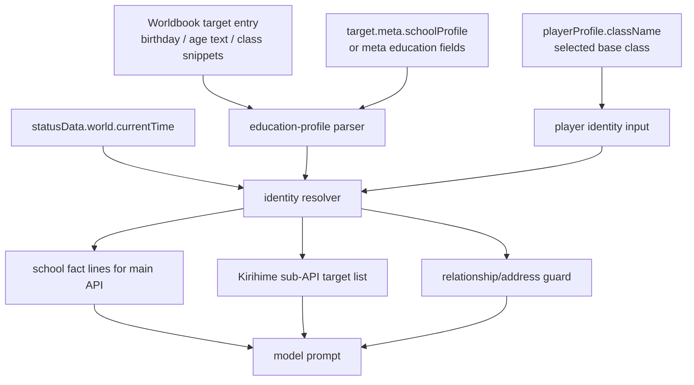

# School Calendar Handoff

本文档交接本轮“升学身份链路重构”的实际实现，供后续评审模型或工程师检查。代码文件均按 UTF-8 保存；新增代码标识符和注释使用英文，中文只出现在 prompt 文案和测试样例中。

## 目标与结论

本轮把“当前身份 / 年级 / 班级 / 是否学姐”从旧的静态 `meta.className`、`relationship.ts` 硬编码和副 API 猜测中收束到统一 resolver。

关键原则：

- 角色年级优先由 `world.currentTime + birthday + 日本学年切点` 计算。
- 世界书和 target state 只提供生日、学校、班级片段、大学/毕业资料，不负责决定当前年级。
- 副 API 不判断日期，只接收 resolver 已算好的当前身份和 user 学年关系。
- `syncSchoolCalendarState` 不再回写 `playerProfile.className` 或 `target.meta.className`，避免存档被日期推进污染。

## Data Flow



当前实现里，NPC 的年级计算在 `identity-resolver.ts`：

```text
current date -> school year
birthday -> high-school start year
grade = schoolYear - highSchoolStartYear + 1
grade <= 0: middle-school fallback if class snippet exists
grade 1..3: select matching class snippet, e.g. 2年B班 / 3年A班
grade > 3 or fixed graduation date: graduate
```

诗羽毕业典礼 `2013-03-04` 是剧情日历硬锚，保留为优先规则。玩家目前没有生日字段，所以玩家仍使用 `playerProfile.className` 作为选择基底，并按 2013 新学年滚动；这是本轮刻意保留的兼容默认。

## Main Files

- `src/islandmilfcode/school-calendar/education-profile.ts`
  - 解析世界书或 state 中的生日、年龄文本、学校、班级片段、大学信息。
  - 不决定当前年级；班级片段的 `date` 不再作为升学权威。

- `src/islandmilfcode/school-calendar/identity-resolver.ts`
  - 核心身份 resolver。
  - `resolveTargetSchoolIdentity()` 对 NPC 用生日和当前日期计算年级。
  - `resolvePlayerSchoolIdentity()` 对玩家用所选班级基底计算。

- `src/islandmilfcode/school-calendar/relationship-guards.ts`
  - 根据 user 和 target 的 resolved identity 生成同班、同级、学姐、学妹、毕业、跨校关系护栏。

- `src/islandmilfcode/school-calendar/prompt-adapter.ts`
  - 给主 API、手机 API、夏野雾姬副 API 输出同一套身份事实。

- `src/islandmilfcode/worldbook/index.ts`
  - 角色世界书导入时写入 `meta.schoolProfile`、`birthday`、`ageText`、`educationText` 等原始资料字段。
  - `meta.className` 仍保留 legacy 显示兼容，但不再是当前身份权威。

- `src/islandmilfcode/relationship.ts`
  - 删除旧 `canonicalClass` / `buildClassRelationLine` 的硬编码班级判断。
  - `getCharacterAnchorGuidance()` 改为调用统一 school relation guard。
  - 诗羽 `Rule 5` 从“可靠的学姐模式”改为“可靠的创作者前辈气质”，避免污染 user 学年关系。

- `src/islandmilfcode/actions/index.ts`
  - 夏野雾姬副 API 角色名单使用 `buildKirihimeSchoolIdentitySegment()`。
  - 角色当前身份、与 user 学年关系、原作关系仅对安艺伦也三者分开注入。

- `src/islandmilfcode/scripts/simulate-school-calendar.ts`
  - 不调用真实 API。
  - 用世界书样例格式仿真主 API 和夏野雾姬副 API 会看到的身份事实。

## Review Points

评审时请重点看这些问题：

1. NPC 年级是否真的由生日和当前日期算出，而不是靠 `后升入`、`2013年` 等世界书短语硬推。
2. 班级字母是否只是从匹配年级的班级片段中取值，例如惠 2012 学年 `2年B班`、2013 学年 `3年A班`。
3. 玩家没有生日字段时，使用 `playerProfile.className` 作为基底是否可接受；如果未来要完全同构，需要给玩家档案加 birthday 或 enrollmentYear。
4. 诗羽在 `2013-03-04` 后是否稳定为毕业/早应大学文学系身份。
5. 玩家选择三年级时，诗羽在毕业前是否不会被默认写成 user 的学姐。
6. 夏野雾姬副 API 是否只使用 resolver 输出，不把“原作关系=学姐”套到 user 身上。
7. `syncSchoolCalendarState` 是否没有再改写 `playerProfile.className` 或 `target.meta.className`。

## Verification

已执行：

```bash
npm run simulate:school-calendar
npm run build:dev
```

`simulate:school-calendar` 覆盖：

- `2012-03-31` 分班前，不允许当前班级事实。
- `2012-04-05` 惠 `2年B班`、英梨梨 `2年G班`、诗羽 `3年C班`。
- 玩家三年级时，诗羽毕业前不被判成 user 的学姐。
- `2013-03-04` 诗羽毕业，不再是日常上课三年级。
- `2013-04-01` 惠 `3年A班`、英梨梨 `3年F班`、出海 `1年C班`。
- `syncSchoolCalendarState` 不回写玩家或 target 的 legacy className。
- 夏野雾姬输入分离当前身份、user 学年关系、安艺伦也原作关系。

全仓 `npx tsc --noEmit` 仍有既有 unrelated 类型错误，主要来自全局类型、未使用变量和其他模块；本轮新增的 `school-calendar`、世界书解析和仿真脚本在构建与仿真中通过。

## Known Limits

- 玩家身份还没有 birthday 字段，所以玩家年级不能像 NPC 一样完全按生日计算。当前策略是保留玩家所选班级/年级作为基底，再按学年滚动。
- `meta.className` 仍保留给旧 UI 和旧逻辑兼容，但不应作为当前身份判断权威。
- 世界书中若某角色缺生日，只能退回内置 fallback 或已有班级片段；评审应确认这是否符合后续资料源设计。

