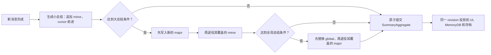
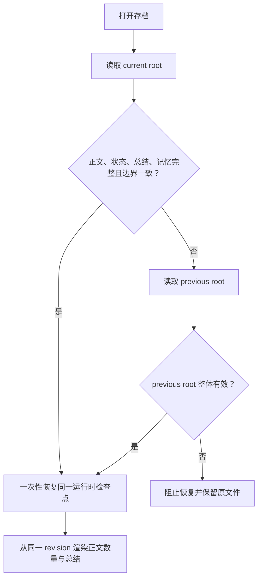

# 总结存档清零现象：结构结论与 PC SillyTavern 测试记录

> 记录日期：2026-08-02  
> 当前阶段：记录现象、理想结构与排除项；尚未定位触发时机，不是修复报告。  
> 修改边界：本轮未修改代码、存档或迁移逻辑。

## 1. 问题现象

已收到过一种异常界面状态：正文总历史仍有约 360 条，但总结游标为 0，小总结、大总结和全局总结全部为空。

如果该存档此前确实生成过总结，这不是正常的总结晋升结果。它表示界面拿到了有效正文数量，却拿到了空的或默认的总结快照。

另有一条来自其他玩家的外部报告：进入存档后新楼层再次消失。该报告不是本次 PC 实测存档，当前只作为相关线索保留，不能当作本机复现证据，也不能据此认定与总结清零具有同一根因。

## 2. 2026-08-02 PC SillyTavern 实测

### 2.1 测试环境与证据归属

- 平台：PC SillyTavern。
- 测试对象：当前可正常读取总结的个人存档。
- 本轮前三张截图属于当前存档测试。
- “新楼层开始还是又进去没了”的聊天截图来自其他玩家，不属于当前存档。

### 2.2 初始状态

测试开始时总结面板显示：

- 已总结到楼层 `#240`。
- 待小总结 `3/5`，未触发。
- 小总结 `27` 条，待大总结 `27` 条。
- 大总结 `1` 条。
- 全局总结：无。
- 提示还差 `2` 条小总结触发大总结。

### 2.3 操作与结果

| 序号 | 操作 | 实测结果 | 当前判断 |
|---|---|---|---|
| 1 | 刷新页面并重新进入存档 | 总结仍在，读数保持 | 通过 |
| 2 | 完全关闭 SillyTavern，再启动并进入存档 | 总结仍在 | 通过 |
| 3 | 继续生成新楼层 | 总结和正文继续正常推进 | 通过 |
| 4 | 继续生成直至触发总结 | 正常发生总结晋升，没有清零 | 通过 |
| 5 | 手动保存，再读取该存档 | 总结和正文均正常恢复 | 通过 |
| 6 | 从本机 `user/files` 恢复存档 | 本次恢复后总结仍在 | 通过，但历史上曾出现一次异常 |

触发总结后的面板显示：

- 已总结到楼层 `#245`。
- 待小总结 `0/5`，未触发。
- 小总结 `1` 条，待大总结 `1` 条。
- 大总结 `2` 条。
- 全局总结：无。

从 `小总结 27 / 大总结 1` 变化到 `小总结 1 / 大总结 2`，同时游标从 `#240` 前进到 `#245`，符合“小总结被大总结消费”的正常晋升行为，不属于清零。

### 2.4 本轮可以排除的范围

当前证据可以初步排除以下稳态操作在这份存档、这套 PC SillyTavern 环境和当前版本中必然触发问题：

- 普通页面刷新。
- 刷新后重新进入同一存档。
- 完全关闭并重启 SillyTavern。
- 正常生成新楼层。
- 正常触发一次总结晋升。
- 当前版本下手动保存并重新读取同一存档。
- 当前版本、当前测试文件下从本机 `user/files` 恢复。

这不等于排除了所有 PC SillyTavern 或本机恢复路径。当前尚未覆盖旧版本存档、跨版本首次打开、旧文件恢复进新版、迁移后首次自动保存、不同历史格式、不同本机桥版本或异常中断等条件。

### 2.5 历史关联线索

此前曾有一次明确的操作关联：点击从本机 `user/files` 恢复存档后，发现总结消失。该次没有保留下足够的恢复前后版本、root 和 summary/memory 对照数据，因此目前只能记为历史相关性，不能认定为稳定触发步骤。

本轮再次执行本机 `user/files` 恢复没有复现。这说明“本机恢复”单独作为条件并不足以稳定触发；差异更可能来自被恢复文件的版本、schema、生成该文件时的保存实现，或恢复后执行的迁移分支。

## 3. 当前假设排序

### 第一优先：旧版本文件经本机恢复进入新版迁移

在常规刷新、重启、续写、总结晋升、当前文件手动读取和当前文件本机恢复均未复现后，优先检查的已不是“恢复按钮本身”，而是以下组合路径：

```text
旧版本生成的本机 user/files 存档
-> 新版本读取
-> summaryStore / memoryDB / archive schema 迁移
-> 首次恢复或首次自动保存
-> 总结变为空快照
```

重点包括：

- 旧版 `summaryStore` 与新版 `memoryDB` 同时存在时选择了错误来源。
- 结构有效但内容为空的 `memoryDB` 覆盖了旧版非空总结。
- v3 root 中 `summaryHash` 与 `memoryHash` 来自不一致的检查点。
- 迁移或恢复时缺少某块数据，程序用默认空总结补齐，随后又被自动保存。

以上均为待验证假设，不是已确认根因。下一阶段应优先找到当时发生清零的本机文件副本、生成它的程序版本和恢复它的目标版本，再设计针对性复现。若只用当前版本重新生成并恢复当前格式文件，测试价值有限。

## 4. 已检查到的当前保存流程

当前运行时存在两份完整的总结表示：

1. `summaryStore`：保存 global、major、minor、keyFacts、cursor 等。
2. `memoryDB`：保存 summaries、facts 和 `lastProcessedIndex` 等。

两份数据在 v3 root 中分别以 `summaryHash` 和 `memoryHash` 持久化；加载时也分别恢复。UI 的正文总数来自 `messageWindow`，总结游标和各级数量来自 `summaryStore`。因此，当前结构允许正文与总结在运行时落入不同检查点。

正常总结晋升规则是：

- 小总结生成后追加 minor，并推进 cursor。
- 大总结生成时先产生 major，再消费它覆盖的 minor。
- 全局总结生成时替换 global，再消费它覆盖的 major。

所以总结条数减少可以是正常压缩；cursor 回到 0 且全部总结消失，才是需要追查的空快照现象。

## 5. 理想结构

系统应只有一个权威 `SummaryAggregate`：

```text
SummaryAggregate
├── revision
├── cursor / floorBoundary
├── global
├── majors[]
├── minors[]
└── keyFacts[]
```

UI、Prompt 和 MemoryDB 都应是同一个聚合对象的投影，而不是可以彼此覆盖的独立真相。



### 必须保持的不变量

- `summary.cursor == summary.floorBoundary == memory.floorBoundary == memory.lastProcessedIndex`。
- 当前总结覆盖范围连续表示 `[0, cursor)`。
- 晋升先提交父总结，再退役被覆盖的子总结。
- 除明确回滚或人工重置外，覆盖边界不能倒退。
- 消息数量、状态、总结和记忆必须属于同一个 root revision。
- 当前 root 不一致时只能整套回退 previous root，不能用默认空对象补一块后继续保存。



## 6. 后续测试入口

下一阶段暂不扩大到随机操作，应围绕版本迁移准备可丢弃副本并记录：

- 存档最后一次正常使用的程序版本。
- 首次出现清零时升级前后的版本。
- 原始存档是 v2 聚合格式、v3 archive，还是更早格式。
- 当时从 `user/files` 恢复的原始文件；不要先用当前版本重新保存覆盖。
- 该文件由哪个程序版本和本机桥版本生成。
- 首次迁移前的 `summaryStore`、`memoryDB`、root revision 和对象 hash。
- 首次迁移完成但尚未继续生成或自动保存时的对应数据。
- 迁移后的第一次刷新、第一次续写和第一次自动保存分别发生了什么。

在拿到这些证据前，不修改保存逻辑，也不把“版本迁移”写成确定结论。
