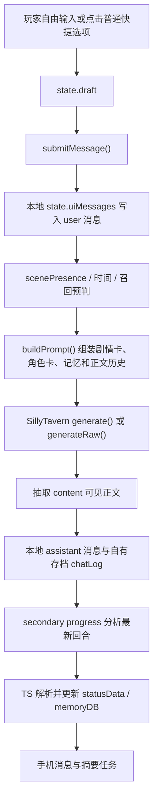
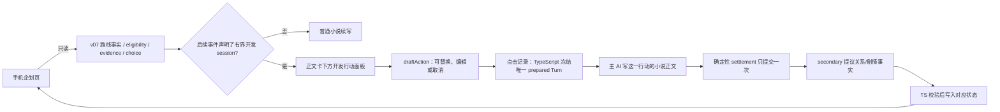
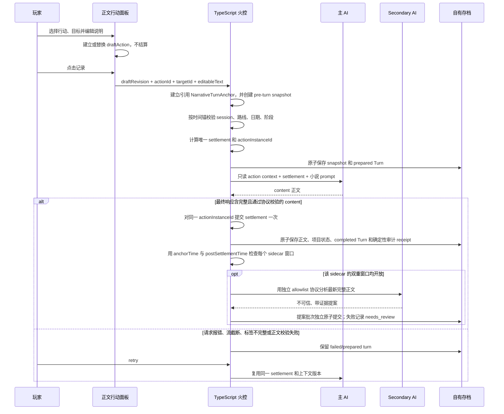

# V07 游戏开发玩法与 AI 协作架构交接 v0.1

> 文档性质：人工审查拒绝后的只读架构交接，不是实现完成报告。
> 生成时间：2026-07-10（Asia/Shanghai）
> Git 分支：`main`
> 基准提交：`051a325796fbfbcf708ae9e458bb5dc0ec962c92`（工作树为 dirty）
> 当前接通状态：`只是本地状态演示`，且人工没有确认宿主/数据库/插件隔离。
> 本轮权限：允许只读审计与新增交接文档；禁止修改代码、整体框架或生产接通链。

## 1. 人工审查结论

来源：v0.1 艾尔登特人工审查表。

| 审查层 | 分数 | 结论 |
| --- | ---: | --- |
| 体验 | 20/50 | 企划路线页与游戏开发玩法被混在同一预览界面；没有明确给出本地打开方式。 |
| 代码结构 | 20/50 | 路线状态机、项目状态栏、人工 Review 和开发行动共用一份页面状态。 |
| 接通 | 10/50 | 人工未确认没有宿主楼层、数据库或插件钩子；不能宣称已经接通。 |

最终决定：`拒绝`，并因接通问题阻塞。

本轮允许：

1. 不修代码。
2. 只读理解项目整体架构和当前 AI 协作方式。
3. 思考单飞线、红坂朱音线如何在现有小说生成框架中承载游戏开发玩法。
4. 生成足以让新上下文直接接手的详细交接文档。

本轮禁止：

- 修改 `.ts`、`.css`、`.html`、JSON、数据库 schema 或 prompt。
- 接入真实生成、memoryDB、手机 choice、宿主楼层或插件钩子。
- 把上一轮预览继续包装成正式方案。

## 2. 证据口径

本文使用以下标签：

- `[已检查]`：读取了当前工作树源码或用户截图。
- `[已执行-静态]`：执行了 `rg`、`Get-Content`、`git status` 等只读命令。
- `[历史已执行/人工否决]`：上一轮跑过仿真、构建或 Playwright，但成果已被人工拒绝，不能作为验收。
- `[设计结论]`：根据代码和人工反馈收敛出的后续架构，不代表已实现。
- `[待人确认]`：代码无法决定的产品选择。

本轮没有运行真实 SillyTavern 请求，没有创建宿主消息，没有写 memoryDB，也没有运行浏览器验收。

## 3. 三张截图表达的产品边界

### 3.1 手机首页

`QQ_1783687766934.png` 中的“企划”是一个手机应用入口，与消息、日历、状态、记忆库、音乐、画图并列。

产品含义：

- 它是一个查询和确认界面。
- 它不应变成游戏开发主战场。
- 它不应长期显示项目数值、员工列表、行动按钮或艾尔登特 Review 队列。

### 3.2 手机企划页

`QQ_1783687776026.png` 显示的是日期闸门和路线准备节点：朱音压力、第二作准备、惠共同企划、黑金反击。

产品含义：

- 企划页负责路线事实、日期窗口、缺项、证据和最终 choice。
- 第七卷开放前只显示预览和当前时间。
- 企划页读取状态，不负责演出本轮开发行动。

### 3.3 正文页

`QQ_1783687806354.png` 显示 AI 小说正文、角色台词、正文后的行动选项，以及“继续书写”输入框。

产品含义：

- 实际游戏开发行为必须发生在正文回合。
- 玩家选择一个开发方向，仍由 AI 写出这一轮发生的故事。
- 游戏状态结算必须附着于这次正文回合，但不能由 AI 自由改数值。

## 4. 当前项目的真实架构

### 4.1 总结

`[已检查]` 当前产品本质是：

> 借用 SillyTavern 生成接口和世界书能力、以本地状态为权威的独立手帐式 AI 小说续写器。

其中 `generate()` 分支意图进入酒馆预设栈；`generateRaw()` 回退分支使用自组 `ordered_prompts`。没有真实请求日志时，只能确认调用分支，不能把 raw 分支也宣称为“使用了宿主预设”。

它不是：

- 真实宿主楼层驱动的同层卡。
- shujuku/ACU 原生消息工作流。
- 已完成的经营模拟游戏。
- AI 可直接修改全部变量的 agent。

### 4.2 当前主回合



关键代码证据：

- 自由输入入口：`actions/index.ts:1150` 的 `submitMessage()`。
- 主请求：`actions/index.ts:1287-1343`，优先 `generate()`，否则 `generateRaw()`。
- 正文 prompt：`message-format.ts:1353-1545`。
- 正文硬契约：`message-format.ts:1502-1507`，可见正文进入 `<content>`。
- 正文后顺序：`actions/index.ts:1426-1474`，依次 progress、手机、摘要。
- progress prompt：`message-format.ts:1788-1920`。

### 4.3 普通快捷选项不是游戏动作

`[已检查]` 现有 `<options>` 链只处理文本：

1. `message-format.ts:326` 解析 `<options>`。
2. `render.ts:194-220` 把文本渲染为按钮。
3. `index.ts:1127-1158` 点击后只把文字填入 `draft`。
4. `index.ts:3085-3092` 玩家点击“记录”后才调用 `submitMessage()`。

这些选项没有稳定 action ID、没有一次性结算 ID、没有项目状态事务，也不会自行改变路线。

当前严格选项协议还固定为四项：

- `message-format.ts:37` 定义四个固定前缀。
- `message-format.ts:339-370` 要求严格块正好四行。
- `快捷回复选项_世界书条目示例.json:52` 同样要求四项。

因此，不应把五个游戏开发行动直接塞进旧 `<options>` 并假装已经有可靠游戏协议。

### 4.4 当前权威状态

| 数据 | 当前实际权威 | 持久化/镜像 |
| --- | --- | --- |
| 正文 | `state.uiMessages` | 序列化为自有存档 `chatLog` |
| 世界和角色当前状态 | `state.statusData` | 镜像到 MVU/`stat_data`、localStorage 和存档 |
| 长期结构化记忆 | `state.memoryDB` | 随自有存档进入 IndexedDB |
| 摘要 | `summaryStore` 与 `memoryDB.summaries` | 随存档保存 |
| 剧情卡 | `plotLibrary` | 从宿主世界书读取，作为 prompt 输入 |
| 角色卡 | `characterCardLibrary` | 从宿主世界书读取，按场景注入 |
| 临时 UI/运行辅助 | `runtimeFlags` | 随 GameState 保存，但不适合作为剧情权威 |

`index.ts:357-359` 明确写明会话期间以 `state.statusData` 为权威。自动存档在 `index.ts:522-535` 保存 GameState、chatLog、summaryStore 和 memoryDB。

### 4.5 当前不是宿主楼层驱动

`[已执行-静态]` 搜索结果：

- `createChatMessages` 只有 `types.ts:543` 的类型声明，没有生产调用。
- 生产 TypeScript 没有 `MESSAGE_SENT` 调用。
- 生产 TypeScript 没有 `/trigger` 调用。
- `state/store.ts:794` 的 `loadMessagesFromChat()` 没有调用者。
- `persistConversation()` 在 `index.ts:469` 只进入自有存档。

因此，当前代码检查支持“没有主动创建真实/隐藏宿主楼层”的结论；但人工审查没有确认这一点，所以接通状态仍是阻塞，不能用静态搜索替代真实日志验收。

## 5. V07 当前真实状态

### 5.1 已存在的纯 TypeScript 实验

上一轮新增但未获人工接受：

- `plot-state-machine/v07.ts`：两个日期窗、三路线、`solo_route_open`。
- `plot-state-machine/proposal.ts`：严格 AI 提案审核。
- `plot-state-machine/resolver.ts`：确定性 eligibility。
- `plot-state-machine/choice.ts`：玩家 choice 守门和 commit 描述。
- `scripts/simulate-v07-routing.ts`：mock `generateRaw` 仿真。
- `gamedevelop-preview/`：被拒绝的本地实验室。

`[历史已执行/人工否决]` 仿真曾通过 80 项断言，但只证明纯函数和 mock envelope，不能证明生产 AI 链、memoryDB、手机页或宿主接通。

### 5.2 未接入的严格实验与旧接受路径并存

`[已检查]` 新 proposal validator/resolver 尚未接入生产，因此当前不是“两个活跃 writer”。真实风险是：严格实验没有生产调用，而旧 parser/commit 仍保留一个潜伏的接受路径：

- `message-format.ts:1775` 的 legacy `buildStateDeltaInstruction()` 仍声明 `剧情开关.v07.*`，但当前主正文恒定 `skipProgress:true`，不能把这段残留当作每轮真实发送的 prompt。
- 实际正文后使用的 `buildProgressPrompt()` 位于 `message-format.ts:1788-1920`，其中没有 v07 开关契约；因此不能期待 secondary AI 主动稳定输出路线事实。
- `message-format.ts:2128-2133` 仍把该文本解析进 `ProgressUpdate.plotFlags`。
- `memorydatabase/commit-points.ts:53-58` 仍调用 `commitPlotFlagDeltas()`。
- `plot-state-machine/memory.ts:6-26` 逐条静默写入，没有证据、整批事务或 repair。
- `SecondaryTaskKind` 没有独立 `plot-flags`；当前通用 secondary 允许回退 `generate()`，不满足未来 v07 writer 必须 raw-only 的合同。
- `plot-state-machine/prompt.ts` 在没有 snapshots 时直接返回空字符串，也没有注入统一 resolver 的 eligibility、缺项和 choice；同时仍允许 `SAE_07-8` 绕过日期窗。
- 手机企划页 `phone/render.ts:1079-1250` 自己复制日期门，只读 flag，不调用统一 resolver、choice 或 evidence。

所以当前状态不是“v07 已可靠接通”，而是“严格协议只是本地实验，生产仍留有不可靠接受路径”。纯 route-agnostic 的项目状态和 reducer 可以先做；但接入新 v07 writer 的同一轮必须删除旧接受路径。在此之前，任何生产游戏开发 session 都不得消费 route choice、不得自动激活，也不得声称两条路线已经接通。

## 6. 上一轮为什么失败

### 6.1 把四种状态装进一个对象

`gamedevelop-preview/main.ts:134-179` 同时持有：

- 项目和员工状态。
- v07 剧情事实。
- 最终路线 choice。
- AI 提案实验室状态。

这些状态的生命周期完全不同：

| 状态 | 生命周期 |
| --- | --- |
| 路线事实 | 章节级、稀疏、带证据、通常单向成立 |
| 最终 choice | 玩家手动、唯一、锁定 |
| 游戏开发项目 | 高频、每回合变化、必须回滚 |
| QA 提案状态 | 开发调试临时数据，不属于玩家存档 |

### 6.2 把四种界面装进一页

`gamedevelop-preview/index.html:29-138` 同屏放置项目仪表盘、员工、Review 队列、剧情信号、提案实验室和路线确认。

结果：

- 手机企划页与开发玩法边界消失。
- 玩家看到的是工程 QA，而不是故事内行动。
- 艾尔登特 Human Review 被误做成玩家每回合按钮。
- 路线事实被开发行动直接点亮，失去正文证据语义。

### 6.3 固定员工违反路线语义

当前预览固定 User、惠、英梨梨、诗羽为工作人员。`剧情第七卷.json:2003-2005` 明确要求：

- 朱音线仍保留黑金二人组对朱音的阻力。
- 单飞线让黑金二人组拥有不依赖 User 的创作者同盟。
- 留下线才需要把惠共同企划和黑金意志合流。

因此任何路线都不能默认把惠、英梨梨、诗羽锁成同一项目员工。

### 6.4 玩法本身也没覆盖用户要求

- 预览没有“音乐”主行动。
- `rest` 只是通用降疲劳，没有“和女孩子们放松/约会”的角色目标。
- 行动结算和路线事实被直接绑定。
- 项目包含 budget、fun、creativity、polish、hype、bugs、全员 skill/morale 等大量尚无生产契约的数值。

## 7. 目标架构：艾尔登特舰体与武器库

本节使用“舰体/武器库”比喻描述稳定边界，不表示要重写整个系统。

### 7.1 舰体

稳定舰体是现有手帐小说框架：

- 正文阅读器。
- 自由输入和重新生成。
- `<content>` 流式正文。
- 世界书剧情卡和角色卡。
- summary/memoryDB 连续性。
- 自有存档、回滚和读档。

游戏开发玩法必须安装在这个舰体上，不能另造一套与正文平行的经营应用。

### 7.2 航海系统

`plot-state-machine` 只负责：

- v07 剧情事实。
- 路线 eligibility。
- 缺失条件。
- 玩家最终 choice。
- 有界路线 prompt。

它不负责项目进度、员工、疲劳、行动回合或游戏质量。

### 7.3 火控系统

TypeScript 是火控系统，负责：

- 当前是否处于游戏开发 session。
- 五个行动是否合法。
- 当前路线和项目阶段的规则。
- 唯一 `actionInstanceId`。
- 确定性基础结算。
- 写入幂等、存档、回滚和失败重试。
- AI 提案格式、证据和边界校验。

### 7.4 五个武器位

用户指定的五个稳定行动域：

| action ID | 显示名 | TypeScript 负责 | AI 负责 |
| --- | --- | --- | --- |
| `art` | 原画 | 行动合法性、目标合法性、项目轨道、耗时/疲劳基础效果 | 演出已选择的创作内容、合作目标和冲突 |
| `scenario` | 剧本 | 剧本轨道、目标合法性和项目阶段约束 | 演出已选择的改稿、讨论和创作取舍 |
| `music` | 音乐 | 音乐轨道、目标合法性和资源约束 | 演出作曲、选曲、录音及已选择角色的互动 |
| `programming` | 程序 | 程序轨道、目标合法性、故障/完成条件 | 演出调试、实现功能、赶工及已选择角色的协作 |
| `rest_date` | 放松/约会 | 恢复资格、目标合法性、不能重复结算 | 演出与已选择目标的休息/约会和关系表现 |

五个 action ID 是代码命令，不是 AI 自由文本。合作/约会目标由玩家选择并由 TypeScript 校验；AI 只演出已确定的目标。AI 写出的关系变化仍只是正文表现，结构化变化必须经过独立提案和校验。

目标选择也是代码合同：

- `selectedTargetId` 为单一角色 ID 或 `null`，不接受 AI 自由填写的人名。
- `rest_date` 默认 `required`，必须从当前 route/session 的合法目标列表选择一人。
- `art`、`scenario`、`music`、`programming` 默认 `optional`，`null` 明确表示独自完成；具体 session 可以把某项收紧为 `required`，但不能越过合法目标 resolver。
- UI 仅在 action 允许目标时显示角色选择控件；required 未选时禁用“记录”，optional 必须提供“独自完成”。
- 改选 action 后立即重新执行 target policy，不合法的旧目标被清空；AI 不能自动补选。

### 7.5 AI 船员

AI 有两个受限岗位：

1. 主 AI：根据已确定的行动和只读结算写小说正文。
2. secondary AI：从最新完整正文提出字段白名单内的关系、叙事 memory 事件或 v07 事实等带证据提案。

游戏开发回合不得原样复用当前 `buildProgressPrompt()`。现有通用 progress 可以改时间、地点、五维、服装、亲密状态、主线事件和物品，权限远大于开发回合需要。未来必须使用独立 task/protocol，或由 TypeScript 提供显式字段 allowlist；默认拒绝项目轨道、疲劳、行动耗时、`currentMainEventId`、`mainEvents`、session 激活状态、route choice 和 settlement。允许的“事件”只指可审计的叙事/memory 事件记录；主线事件推进与 session 激活只能由确定性事件路由修改。v07 facts 仍只能走独立 raw-only `plot-flags` 协议，不能混回通用 progress。

AI 没有以下权限：

- 选择最终路线。
- 自造 action ID。
- 重算项目基础效果。
- 修改已经准备好的 settlement。
- 在失败重试时重新抽取结果。
- 直接写 memoryDB 或 GameDevelopmentState。
- 修改当前主线事件、事件激活结果或 session 生命周期。

### 7.6 舰长

玩家是唯一舰长：

- 选择行动。
- 选择约会/合作目标。
- 可修改行动的自然语言说明。
- 在手机企划页确认最终路线。
- 通过调试工具人工修正错误存档。

### 7.7 黑匣子与损管

行动有两个严格分开的阶段：

1. 玩家点击行动卡时，只创建或替换可编辑的 `draftAction`。此时没有 `actionInstanceId`、没有 settlement，也没有已准备 Turn。
2. 玩家点击“记录”时，TypeScript 校验当前 `draftRevision`，捕获本轮时间锚和 pre-turn snapshot，然后一次性冻结不可变的 prepared Turn，生成 `actionInstanceId` 和 settlement。

`draftAction` 的替换/取消合同：

- 点击另一行动会原子替换旧 draft，并清理不再合法的目标；旧 draft 从未结算。
- 编辑自然语言只改变 draft 文案，当前 action/target 必须持续可见。
- 显式取消、离开合法 session 或清空选择会删除 draft；没有选择或必填文案为空时“记录”不可提交。
- “记录”开始后禁止改选或取消；失败只能重试同一 prepared Turn，或执行明确的整回合回滚。

每个已冻结开发回合必须保存不可变的 Turn 记录；生成失败、重新生成或页面刷新时都复用同一结果，而不是再次结算。

损管系统必须保证：

- pre-turn snapshot 在 prepared Turn 成为权威前创建。
- 点击“记录”后，snapshot 与 prepared Turn 原子落盘；仅点击行动卡不产生 pending action。
- 生成失败不丢行动，也不重复扣除资源。
- retry 使用相同 action、settlement、prompt version 和 context fingerprint。
- 回滚正文同时回滚项目状态。
- 同一个 `actionInstanceId` 最多应用一次。

## 8. 企划与游戏开发的最终分层



### 手机企划页

只允许：

- 当前日期和两个 v07 时间窗。
- 路线准备事实及正文证据。
- 三路线 eligibility 和缺项。
- 玩家最终 choice。
- 失败/needs_review 状态。

明确禁止：

- 项目数值。
- 五个开发行动。
- 员工技能和士气。
- 艾尔登特 Review 按钮。
- AI 原始提案调试面板。

### 正文阅读器

在有界 game-development session 内，正文卡下方显示独立的开发行动面板，保证五个稳定 action domain 都可达。

该面板不复用通用 `<options>`：

- 每项带稳定 action ID。
- 点击后建立 `draftAction`，并把可读描述填入“继续书写”输入框；玩家可在冻结前编辑。
- 选中的 action、target 和 draft 状态必须可见，不能因为玩家改文案而丢失或偷偷切换。
- required/optional target policy 由 action definition 和 route/session profile 决定；角色选择控件、禁用态和“独自完成”必须与该 policy 一致。
- 只有点击“记录”才冻结 Turn；行动卡点击本身不结算、不生成 `actionInstanceId`。
- 开发 session 内必须隐藏/抑制普通剧情 `<options>` 的可操作按钮；即使模型仍输出 `<options>`，它也不得成为第二套选择面板或改变开发状态。
- 开发 session 外不显示开发面板，普通 `<options>` 才按原流程出现。

五项是同时平铺、分段控件还是菜单属于 `[待人确认]`。架构合同只要求五个 action domain 都能在开发回合中明确访问，不把未经确认的布局当成人工结论。

### QA 预览器

`gamedevelop-preview` 只能是开发者实验室，不能冒充产品界面。

后续必须拆成两个独立 state root/fixture，而不只是同页标签：

1. v07 proposal/resolver 测试视图。
2. game-development reducer/turn 测试视图。

v07 实验 root 不持有项目状态；game-development root 可以接收固定 `routeId` fixture，但不得持有 local route choice、plot flag proposal 或 Human Review 状态。两个视图不能共享上一轮混合 `GameState` 对象。

艾尔登特人工审查信息只出现在 QA 证据和审查邀请中，不进入玩家 UI。

## 9. 游戏开发回合契约

### 9.1 最小权威状态

`[设计结论]` GameDevelopmentState 应成为显式、强类型、可回滚的领域状态，而不是塞进 v07 attributes 或 `runtimeFlags`。

最低字段语义：

```text
projectId
routeId
phase
turn
remainingTurns
tracks:
  art
  scenario
  music
  programming
fatigue
draftAction  # 非结算态，可替换/取消
pendingAction
appliedActionIds
```

第一版不应继承预览器全部数值。以下字段在获得玩法契约前不进入最低状态：

- budget
- fun
- creativity
- polish
- hype
- bugs
- 固定员工 skill/morale

### 9.2 为什么不能用 runtimeFlags

- `runtimeFlags` 当前主要保存 UI 偏好、绘图设置、调试标记和临时状态。
- `createRollbackSnapshot()` 在 `state/store.ts:344-351` 不保存 runtimeFlags。
- 把项目权威放进去会导致 Reader 回滚正文后项目状态不回滚。

### 9.3 为什么不能用 v07 attributes

- v07 facts 是稀疏章节事实，开发进度是高频可逆状态。
- attributes upsert 会让旧值 expire。
- 当前 rollback 清理新 memory 行时不会可靠复活已 expire 的旧项目快照。
- memoryDB 适合保存开发行动审计记录、证据和长期结果，不适合承担当前项目数值权威。

### 9.4 存档边界

未来 GameDevelopmentState 必须同时进入：

- `AppState.gameDevelopment`。
- `GameState.gameDevelopment`。
- `RollbackSnapshot.gameDevelopment`。
- 存档 normalize/migrate。
- 手动存档和自动存档。

这是一次明确的状态/schema 边界变更，必须单独人工批准，不能顺手塞进 `runtimeFlags`。

### 9.5 回合记录

每次行动至少记录：

```text
actionInstanceId
narrativeTurnId
projectId
routeId
actionId
selectedTargetId
actionText
draftRevision
turnAnchorTime
preparedAt
preTurnSnapshotId
settlement
status: prepared | narrating | completed | failed
sourceRange
promptVersion
contextFingerprint
```

## 10. 正确的 AI 驱动回合



基础 settlement 在请求 AI 前确定，但只有最终流结束、完整 `<content>` 可提取且正文协议验证通过后才提交。已有部分可见流式文本不能算成功，也不能触发 settlement、通用 progress 或 secondary；它最多作为失败诊断展示，不进入权威正文。

`NarrativeTurnAnchor` 是所有小说回合的通用编排记录，不只属于 GameDevelopment：

- 每次普通 `submitMessage()` 都在组装主 prompt 前捕获不可变 `narrativeTurnId`、`anchorTime`、用户消息 ID 和 prompt/context 标识，并随该回合的本地 chatLog/GameState 元数据保存。
- 正文页在尚未提交时，以当前只读世界时间和 `PlotRoutingContext.evaluationTime` 判断面板/session 是否可见；此时不能依赖尚不存在的 prepared Turn。
- 开发回合点击“记录”后，prepared Turn 引用本次 `NarrativeTurnAnchor`，并额外保存 pre-turn snapshot、action 和 settlement。
- action/session 合法性和冻结后的 settlement 使用 `anchorTime`，避免生成中途的状态变化反改本轮输入。

主 AI 的 v07 `promptWindow` 也使用双重闸门：`anchorTime` 与真正组装 prompt 时的 `PlotRoutingContext.evaluationTime` 必须同时在窗，任一越界时 v07 block 完全为空。preflight 或其他前置步骤即使把 `2013-03-31` 推到 `2013-04-01`，也不能继续凭旧 anchor 注入 v07；从窗外推进到窗内同样不能提前开启本回合。其他 bounded 主 prompt block 也必须显式声明自己的 build-time gate。

每个 outbound sidecar 还必须在真正发请求前用 post-settlement 当前时间再次检查自己的窗口。v07 `plot-flags` 要求 `anchorTime` 和请求时的 post-settlement 时间都位于 `proposalWindow`；任一越界都不发送。因此 `2013-02-24 -> 2013-02-25` 不会提前开启，`2013-03-31 -> 2013-04-01` 也不会用旧锚重开 v07 prompt。其他 secondary task 必须显式声明自己的窗口策略，不能继承一个无限期通用 prompt。

核心完成事务和 AI sidecar 是两层原子边界：正文、项目状态、action ledger、completed Turn 与确定性 action audit receipt 必须一起成功；AI sidecar 在此后作为独立可失败批次运行。sidecar 失败只记录 `needs_review`，不回滚已经完成的正文和项目回合。任何“必需审计”必须由 TypeScript 在核心事务内确定性生成，不能依赖 secondary 成功。

## 11. 单飞线与红坂朱音线

两条路线共用同一个 game-development 引擎和五个 action ID，只使用不同 route profile。不要复制两套状态机。

### 11.1 单飞线 `solo`

核心：User 自己成为项目负责人，项目不自动拥有原社团全员。

规则方向：

- 自主权高，但人员和资源更紧。
- 合作者按正文关系、当前可用性和玩家选择临时进入。
- 英梨梨和诗羽可以是独立盟友、临时合作方或竞争者，不默认成为员工。
- 惠是否参与取决于已经确认的正文事实，不由 route 名自动决定。
- 音乐可由美智留、外包、素材选择或 User 自己处理，不能因为预览没有音乐就省略。
- 休息/约会是恢复与关系场景，不是免费刷好感。

叙事底线：`剧情第七卷.json:2004` 要求黑金二人组保有不依赖 User 的创作者同盟。

### 11.2 红坂朱音线 `akane`

核心：同一套开发行动进入朱音的高压创作环境，而不是把朱音写成纯反派或万能老板。

规则方向：

- brief、修改、截止期和创作强度更高。
- 高强度可以带来更强推进，也必须伴随疲劳、自主权和关系压力。
- 朱音仍使用普通 affinity，不新增对伦也 obsession。
- 英梨梨、诗羽不是默认员工；黑金共同反击是朱音线的真实阻力和人物重量。
- 约会/休息可以选择朱音或其他合法目标，但不能绕过当前关系与剧情在场规则。

叙事底线：`剧情第七卷.json:2003` 要求朱音面对自己确实伤到并激发了两位创作者。

### 11.3 留下线 `stay`

本次重点不是留下线，但共享引擎必须允许未来接入。只有正文事实已确认后，惠、英梨梨、诗羽、美智留等人才可逐步成为实际协作者。

## 12. 时间窗原则

v07 的 `proposalWindow` 和 `promptWindow` 只服务路线事实和路线选择，不能长期承载后续游戏开发 prompt。

游戏开发必须由未来事件或 session 自己声明：

- `startAt`。
- `endAt`。
- 允许的 route。
- 允许的 phase/action。
- 结束后是否只读。

硬规则：

- session 开始前不显示开发行动，不注入项目 prompt。
- session 结束后项目 prompt 完全为空。
- choice 可以由代码长期读取，但只有下游事件自己的时间窗才能把它重新注入 AI。
- 当前 `剧情第七卷.json` 只到 `SAE_07-8`，不能继续使用预览器虚构的 `SAE_07-GAME-DEVELOP`。

具体开发 session 的开始/结束日期属于 `[待人确认]`，不能从现有 v07 日期窗猜测。

### 12.1 route choice 到事件激活的桥

当前 `plot-routing.ts`、`syncMainEvents()` 和 prompt 白名单以 `StatusData` 为主要输入，memoryDB 中的 choice 不会自动进入事件路由。未来采用显式只读 `PlotRoutingContext`，而不是把 choice 复制进 `StatusData`：

- 编排层在事件激活前从 choice 存储读取并调用统一 resolver。
- `PlotRoutingContext` 同时携带 `statusData`、已验证的 v07 choice、eligibility basis/hash 和用于本次事件发现的只读 `evaluationTime`。
- `plot-routing`/`syncMainEvents` 只消费该 context，不直接读 memoryDB，也不另存第二份 choice 权威。
- 下游事件必须同时声明 route 条件和自己的时间窗；只有事件激活成功后，其白名单 prompt 才能读取 choice。
- choice 缺失、非法或与当前 eligibility 不一致时，按未确认处理，不激活路线 session。

这是一次明确的事件路由 API 边界变更，必须在独立艾尔登特轮次审查。没有这座桥，不能宣称单飞/朱音事件已接通。

## 13. 原子性、回滚与重试

### 必须保护的合同

1. 一个 `actionInstanceId` 最多结算一次。
2. 流式重复结束事件不得重复应用。
3. 页面刷新后 pending action 仍可恢复。
4. 生成失败保留同一 settlement。
5. 重新生成正文不得重新抽项目效果。
6. Reader 回滚必须恢复项目状态和行动 ledger。
7. 正文、项目状态、action ledger、completed Turn 和确定性 action audit receipt 要么全部成功，要么全部不变。
8. route choice 必须记录确认楼层或 eligibility basis/hash；事实回滚后，旧 choice 不得在条件重新成立时静默复活。
9. action/session/settlement 使用通用 `NarrativeTurnAnchor.anchorTime`；prepared Turn 只引用它，不独占它。
10. v07 主 prompt 必须同时通过 anchor-time gate 和 prompt-build-time `evaluationTime` gate。
11. outbound sidecar 必须同时通过自己的 anchor-time gate 和请求时 post-settlement gate；任何事件 ID 或 choice 都不能绕过上界。

当前 `memorydatabase/upsert.ts:30` 的 `commitBatch()` 是顺序修改对象，不具备异常回滚事务。未来“原子提交”应先在 clone 上运行纯 reducer，全部校验通过后再一次替换权威对象。

v07 fact 不能只靠 `sourceRange` 回滚。attribute upsert 会 expire 前驱行，因此每批提交必须产生可逆 commit receipt，记录新增行和被替换前驱行的原状态。receipt 的权威位置固定为随存档序列化的 `memoryDB.extensions.plotCommitReceipts`，每行以稳定 `commitId` 为 ID，并在 `extra` 中保存 new row IDs、predecessor 的 `expired/supersededBy/updatedAt` 原值、sourceRange 和 rollback 状态。

attributes 变更与 receipt 必须先在同一个 memoryDB clone 中全部完成，再一次替换权威对象并立即落盘；不能先写 attribute、后补 receipt。重复提交同一 `commitId` 是 no-op。回滚同样在 clone 上执行：先使本批新行失效，只在不存在更晚存活 successor 时恢复正确前驱，再把 receipt 标记为已回滚；重复 rollback 是 no-op。receipt 缺失、损坏或无法验证时进入 `needs_review`，不得猜测恢复。`sourceRange` 只负责定位和审计，不承担前驱复活语义。

关键 choice/action 后不能只依赖 `persistToSave()` 的 debounce；需要明确的落盘保证，否则用户立即刷新可能丢失刚确认的行动。

## 14. 可复用与必须废弃

### 可复用

- SillyTavern `generate/generateRaw` 传输能力；两分支是否使用预设必须分别记录。
- generation ID 流式隔离和 `<content>` 抽取基础；不能复用当前“有部分文本也算成功”的判定。
- `<content>` 提取和 Saenai 对话渲染。
- 正文卡、自由输入和失败保留 draft 的 UI 基础。
- Reader 回滚入口和快照基础；当前 `rerunReaderMessage()` 不保留 action intent、settlement 或 fingerprint，不能直接作为开发回合 retry。
- 世界书剧情卡、卷级写作协议和角色 0 层卡。
- scenePresence 的在场角色/角色卡筛选子集，以及 memory recall/summary 连续性；不得复用其 route reinterpretation、`plotImpact.currentEventShould` 或 `mainApiGuidance` 去改写已冻结 action/route/settlement。
- v07 的纯 validator/resolver/choice guard。
- `sourceRange` 审计思路；v07 前驱恢复仍需可逆 commit receipt。

### 必须废弃

- 把艾尔登特 Review 当成玩家每回合批准按钮。
- 把开发行动直接映射为 v07 flag。
- 把企划页和开发仪表盘放在同一表面。
- 所有路线固定使用同一员工阵容。
- 用 AI 文本选项承担权威 action ID。
- 用通用 progress AI 结算项目基础数值。
- 在开发回合原样运行当前 `buildProgressPrompt()`。
- 用 preflight timeProposal 决定固定行动耗时。
- 让 scenePresence 或主 AI 重新解释已冻结的 route、action、时间锚或 settlement。
- 用 `runtimeFlags` 或 v07 attributes 保存当前项目状态。
- 用 `SAE_07-8` 或虚构事件绕过游戏开发 session 日期窗。

## 15. 后续接通顺序

每一步都是独立艾尔登特轮次；没有上一轮人工审查表，不进入下一步。

### 轮 0：当前文档轮

- 确认本文三域边界。
- 确认五个固定 action ID。
- 确认 GameDevelopmentState 是显式可回滚状态。
- 不改代码。

### 轮 1：纯状态舰体升级

- 只做 typed GameDevelopmentState。
- 存档、读档、迁移、rollback、action idempotency。
- 不接 AI，不改手机企划，不写 v07 facts。

### 轮 2：休眠行动组件与确定性 fixture

- 只实现五个 action domain、`draftAction`、冻结点和确定性 reducer 的 QA fixture。
- 组件不挂生产 session，不进入正文主流程，不发送 prompt。
- 预览状态与 v07 lab 使用独立 state root。
- 当前接通标签仍只能是“只是本地状态演示”。

### 轮 3：V07 生产完整性

- 新增 raw-only `plot-flags` task，禁止回退 `generate()`。
- 一次 repair、证据/sourceRange、整批零写入，以及与 attributes 同批持久化的可逆 commit receipt。
- 接入新 writer 的同一轮删除旧 plotFlags 接受路径。
- 修正无 snapshots、resolver/choice 注入和 `SAE_07-8` 日期绕过；主 v07 prompt 同时检查 anchorTime 与 build-time evaluationTime。

### 轮 4：手机企划与事件路由桥

- 手机企划消费统一 resolver、证据、缺项和 needs_review。
- 玩家 choice 立即落盘、回读和锁定。
- 建立只读 `PlotRoutingContext`，证明 choice 能进入事件激活层但不会越窗进入 prompt。
- 不显示开发操作或 QA 调试信息。

### 轮 5：有界 session 与行动冻结

- 在人确认的事件/日期窗内声明单飞和朱音 session/profile。
- 生产正文页只在合法 session 显示开发面板，并硬抑制普通 `<options>` 按钮。
- 点击行动只改 draft；点击“记录”才冻结 snapshot、时间锚和 prepared Turn。
- 本轮可以接真实状态读写，但仍不调用 AI。

### 轮 6：主 AI 小说协作

- 主 AI 消费只读 action/settlement 写正文。
- 只有完整、验证通过的最终 `<content>` 才提交 settlement。
- 失败和重生成复用同一 prepared Turn、prompt version 和 context fingerprint。
- scenePresence 只开放经过审查的角色筛选/recall 子集。
- 开发回合显式跳过当前通用 progress/`buildProgressPrompt()`；本轮没有 secondary 写入。

### 轮 7：开发回合 secondary

- 使用独立字段 allowlist，不原样运行通用 progress。
- 关系/叙事 memory 事件提案带正文证据；`currentMainEventId`、`mainEvents`、项目、时间、session、route choice 和 settlement 默认拒绝。
- v07 facts 仍只走独立 `plot-flags` task。
- 每个 task 在发送前通过 anchorTime 与 post-settlement 时间的双重窗口检查。

### 轮 8：完整端到端验收

- 单飞和朱音各复现至少一个完整开发回合。
- 真实 SillyTavern 日志验收。
- 验证生成分支、宿主楼层、`MESSAGE_SENT`、`/trigger`、shujuku/ACU 和数据库钩子是否按批准边界触发或保持静默。

## 16. 后续验收合同

### 体验

- 手机企划页与正文游戏开发明显分开。
- 正文处只在合法 session 提供五个稳定行动域，具体布局与人工确认一致。
- 开发 session 内不会同时出现可操作的普通 `<options>` 面板。
- 玩家能选择、改选、取消、编辑并在“记录”时冻结行动；冻结后不会提交旧 draft。
- 截断/不完整正文不会结算，生成失败和 retry 不会重复结算。
- 单飞/朱音不会显示错误的固定员工。

### 结构

- `plot-state-machine` 不依赖 GameDevelopmentState。
- `game-development` 领域不写 DOM、不决定路线 choice。
- render 不直接结算。
- actions 只负责编排，不堆积全部领域规则。
- state/save/rollback 对项目状态有完整合同测试。
- `PlotRoutingContext` 是 choice 进入事件激活的唯一只读桥，不复制 choice 权威。
- 游戏开发 secondary 使用显式 allowlist，不继承通用 progress 的全量写权限。
- 普通小说回合和开发回合共用持久化 `NarrativeTurnAnchor`，session 发现不依赖 prepared Turn。

### 接通

- 日志证明主请求使用预期 SillyTavern preset/context。
- 明确证明是否创建宿主楼层。
- 明确证明 `MESSAGE_SENT`、`/trigger`、shujuku/ACU 是否触发。
- 项目状态保存、重载、回滚一致。
- 日志证明同一回合始终使用持久化的 `NarrativeTurnAnchor.anchorTime` 和 context fingerprint。
- v07 主 prompt 在回合锚点或实际构建时刻任一越窗时都完全为空。
- v07 sidecar 在回合起点或请求时刻任一越窗时都保持静默。
- choice 能从存储经 resolver 进入事件激活层，非法/失效 choice 不激活 session。
- v07 错误提案零部分写入。
- 人工三项评分未达门槛前不得标记正式可用。

## 17. 当前预览的本地打开方式

当前预览已被人工拒绝，只用于查看历史实验和 QA 证据。

在父工程目录运行：

```powershell
cd E:\web\tavern_helper_template-main
pnpm build:game-preview
Start-Process 'E:\web\tavern_helper_template-main\src\islandmilfcode\gamedevelop-preview\index.html'
```

也可以直接打开：

```text
E:\web\tavern_helper_template-main\src\islandmilfcode\gamedevelop-preview\index.html
```

页面加载的是 `.gitignore` 排除的 `gamedevelop-preview/dist/app.js`。没有先运行构建时，页面脚本可能不存在。

## 18. 工作树保护

当前仓库已有大量未提交用户改动。后续不得清理、覆盖、格式化或回滚这些文件。

特别保护：

- `index.ts`
- `actions/opening.ts`
- `phone/render.ts`
- `render.ts`
- `types.ts`
- `state/store.ts`
- `styles.css`
- `school-calendar/*`
- `version/index.ts`
- 当前 `plot-state-machine/*` 与 `gamedevelop-preview/*` 实验改动

本交接轮只允许新增本文档。后续开始代码轮前必须重新保存 `git status` 和相关 diff。

## 19. 待人确认

以下内容没有现成契约，后续不能由 AI 自行决定：

1. 单飞/朱音游戏开发 session 的准确开始和结束事件、日期。
2. 四条开发轨道使用整数、等级还是里程碑状态。
3. 每次行动消耗多少时间、疲劳，以及失败条件。
4. 哪些角色在每条路线可作为临时合作或约会目标。
5. `rest_date` 第一版是否严格限制单一目标，还是未来允许多人休息场景；在确认前权威字段保持单一 `selectedTargetId`。
6. 五个行动在正文页是同时平铺、分段控件还是菜单；无论布局如何，五个稳定 action domain 都必须可达。
7. 是否最终要接真实宿主楼层；当前架构默认仍是自有手帐存档。
8. 留下路线是否在后续共享同一开发系统。
9. 项目完成后的发布、评价或结局规则。

在这些问题确认前，可以完成状态/回滚基础设计，但不能伪造具体数值和后续事件。

## 20. 新上下文阅读顺序

后续模型不需要重新通读全部历史。建议按以下顺序：

1. 本文档。
2. `AGENTS.md`。
3. `README.md` 与 `docs/module-registry.md`。
4. `actions/index.ts:1150-1474`，理解当前主回合。
5. `message-format.ts:1353-1545` 与 `1788-1920`。
6. `render.ts:194-220`、`1019-1055`。
7. `phone/render.ts:1079-1250`。
8. `state/store.ts:344-411`、`index.ts:506-575`。
9. `plot-state-machine/*`。
10. `剧情第七卷.json:1960-2020`。

## 21. 下一轮范围模板

只有本文获得人工接受后，才能填写下一轮合同：

```text
来源审查表：

允许修改：
- game-development 纯领域状态
- 存档/读档/rollback/idempotency 测试

禁止修改：
- 主 AI prompt
- 手机企划页
- v07 production writer
- 宿主楼层/插件链

完成标准：
- typed state 可保存、重载、回滚
- 同一 actionInstanceId 只应用一次
- 不接 AI 也能通过确定性仿真
- 重新发出艾尔登特审查邀请
```

没有新的人工审查表，不开始代码实现。
