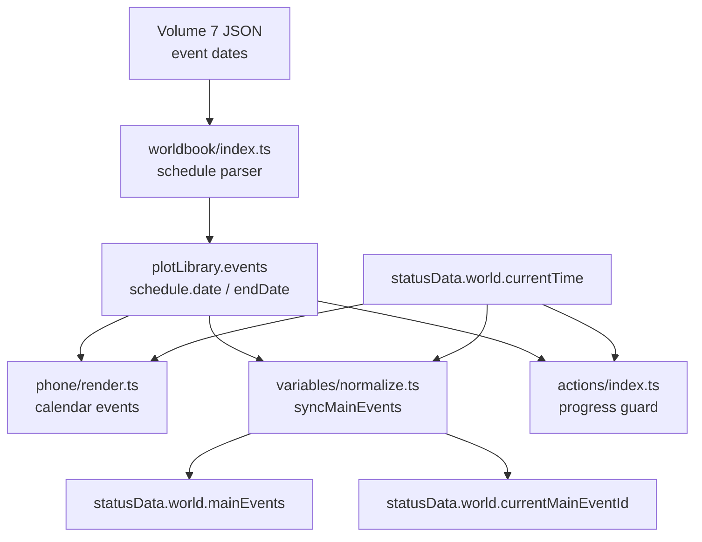
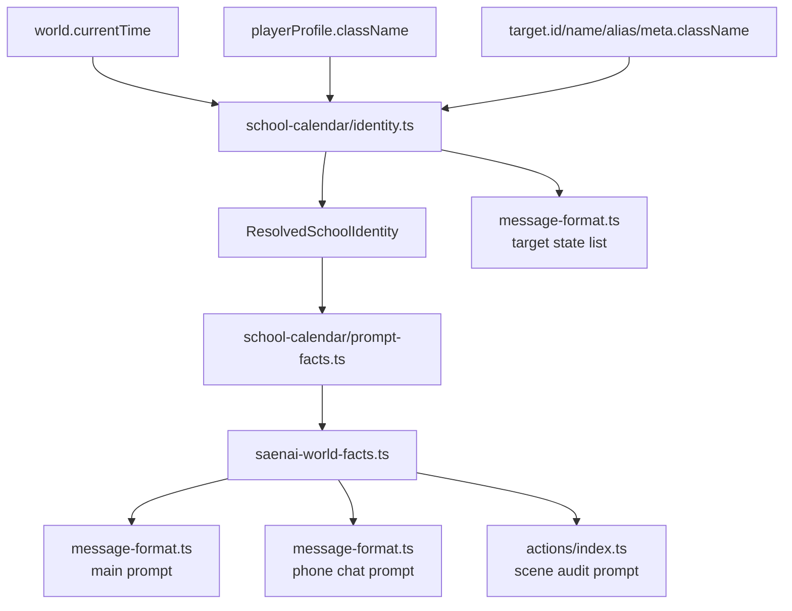
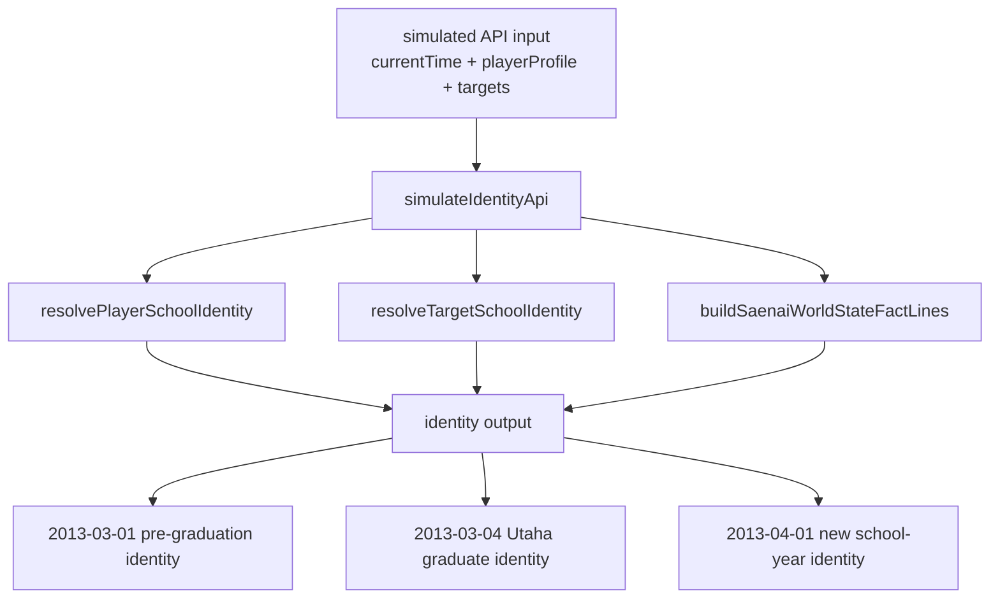

# islandmilfcode 学年身份时间锚第一轮实现报告

仓库：<https://github.com/eriribot/islandmilfcode>

本地代码目录：

```text
D:\card\tavern_helper_template-main\tavern_helper_template-main\src\islandmilfcode
```

GitHub 对应规则：本地 `src/islandmilfcode/foo.ts` 对应仓库根目录下的 `foo.ts`。

本轮目标是把第七卷毕业典礼、诗羽毕业、2013-04 新学年、玩家自选年级、NPC 班级身份统一接入运行时提示词和仿真验证。实现时采用模块化目录，不继续把规则塞进 `message-format.ts` 或 `actions/index.ts`。

## Claude 审计结论校正

Claude 审计中正确的部分：

- `SAE_07-8` 实际触发日是 `2013-03-04`，不是 `2013-03-01`。
- `2013-03-01` 是毕业典礼三天前的惠广播室线 / 黑金二人组美术准备室誓约前置窗口。
- 手机日历主要消费 `plotLibrary.events[*].schedule.date/endDate`，不是直接硬读第七卷 JSON。
- 当前旧系统不是完整学年演算器，主要靠 `playerProfile.className`、`target.meta.className` 和 prompt 事实锚。
- 真正风险在 `2013-04` 后：User / 惠 / 英梨梨可能仍被写成二年级，诗羽可能仍被写成正常上课的三年级学生。

需要修正或补足的部分：

- 本地路径已经从 Claude 文本里的 `E:\web\...` 换成当前 `D:\card\...`。
- 不应只做 prompt 文案锚。第一轮已经落成独立 `school-calendar/` 模块，由 prompt、审稿、手机聊天共用。
- 不建议做单文件巨型 `school-calendar.ts`。本轮拆成 `constants.ts`、`identity.ts`、`prompt-facts.ts`、`index.ts`，避免继续堆大文件。
- 出海规则需要补入：波岛出海进入丰之崎后按 `1年C班` 处理。
- 玩家也必须走同一套学年解析，不能只处理 NPC。

## 已实现代码结构

```text
src/islandmilfcode/
  school-calendar/
    constants.ts
    identity.ts
    prompt-facts.ts
    index.ts
  saenai-world-facts.ts
  scripts/
    simulate-school-calendar.ts
```

新增 npm 脚本：

```json
{
  "simulate:school-calendar": "ts-node --compiler-options \"{\\\"module\\\":\\\"CommonJS\\\",\\\"moduleResolution\\\":\\\"node\\\"}\" src/islandmilfcode/scripts/simulate-school-calendar.ts"
}
```

## 第一轮规则

时间锚：

```ts
export const CLASS_SPLIT_DATE = '2012-04-05';
export const UTAHA_GRADUATION_DATE = '2013-03-04';
export const TOYOGASAKI_2013_SCHOOL_YEAR_DATE = '2013-04-01';
```

玩家规则：

- `2012-04-05` 前：不允许把玩家写成已经完成二年级分班。
- `2012-04-05` 到 `2013-03-31`：保留玩家档案里自选的 `className`。
- `2013-04-01` 后：
  - `1年X班` 升为 `2年X班`。
  - `2年X班` 升为 `3年X班`。
  - `3年X班` 进入毕业生身份。

NPC 特例：

- 加藤惠：`2年B班` -> `3年B班`。
- 英梨梨：`2年G班` -> `3年G班`。
- 霞之丘诗羽：`2013-03-04` 起为丰之崎毕业生；`2013-04-01` 后提示为毕业生 / 大学或校外协力身份。
- 波岛出海：进入丰之崎后为 `1年C班`。
- 其他角色：优先使用 `target.meta.className`，并在 `2013-04-01` 后按通用升学规则推进。

## 数据流程图：剧情日期与主线事件



结论：`SAE_07-8` 的剧情日期仍是 `2013-03-04`。本轮升学系统没有改第七卷排期，只在 prompt/审稿事实层补身份锚。

## 数据流程图：学年身份解析



## 数据流程图：模拟 API 输出判断



仿真覆盖点：

- 玩家自选一年级班级在升学前保留。
- 玩家自选二年级班级在 `2013-04-01` 后升三年级。
- 惠和英梨梨在 `2013-04-01` 后升三年级。
- 诗羽在 `2013-03-04` 起变成毕业生。
- 出海是丰之崎 `1年C班`。
- 世界事实输出包含玩家、惠、英梨梨、诗羽、出海的解析身份。
- 模拟 API 在 `2013-03-01` 按实际日历输出毕业前身份：玩家 / 惠 / 英梨梨仍是二年级，诗羽仍是 `3年C班`。
- 模拟 API 在 `2013-03-04` 输出诗羽毕业生身份。
- 模拟 API 在 `2013-04-01` 输出新学年身份：玩家 / 惠 / 英梨梨进入三年级，诗羽不再是正常在校三年级学生。

## 关键代码片段

`school-calendar/identity.ts` 暴露两个核心入口：

```ts
export function resolvePlayerSchoolIdentity(
  profile: PlayerProfile | null | undefined,
  currentTime: string,
): ResolvedSchoolIdentity {
  // resolves User class identity from date + selected profile class
}

export function resolveTargetSchoolIdentity(target: TargetIdentityInput, currentTime: string): ResolvedSchoolIdentity {
  // resolves NPC school identity from date + canonical target identity + meta class
}
```

`school-calendar/prompt-facts.ts` 负责把解析身份转换成 prompt 事实行：

```ts
export function buildSchoolCalendarFactLines(input: SchoolCalendarFactInput): string[] {
  const playerIdentity = resolvePlayerSchoolIdentity(input.playerProfile, input.currentTime);

  for (const target of input.targets ?? []) {
    const identity = resolveTargetSchoolIdentity(target, input.currentTime);
  }

  return Array.from(new Set(lines));
}
```

`saenai-world-facts.ts` 是共享世界事实入口：

```ts
export function buildSaenaiWorldStateFactLines(input: SaenaiWorldFactInput): string[] {
  const lines = [
    '- Canon fact: Koisuru Metronome ended in 2011; current scenes may reference sales, reader aftermath, and creative wounds, but must not treat it as still serialized.',
    ...buildSchoolCalendarFactLines({
      currentTime: input.currentTime,
      playerProfile: input.playerProfile,
      targets: input.targets,
    }),
  ];

  return Array.from(new Set(lines));
}
```

`message-format.ts` 接入方式：

```ts
const fallbackWorldStateContext = options?.scenePresence
  ? ''
  : [
      'World state facts:',
      ...buildSaenaiWorldStateFactLines({
        currentTime: statusData.world.currentTime,
        playerProfile,
        targets: statusData.targets,
      }),
    ].join('\n');
```

`actions/index.ts` 接入方式：

```ts
const worldStateFacts = buildSaenaiWorldStateFactLines({
  currentTime: currentWorldTime,
  playerProfile: ctx.state.playerProfile,
  targets: ctx.state.statusData.targets,
});
```

仿真脚本入口：

```ts
function simulateIdentityApi(
  currentTime: string,
  playerProfile: PlayerProfile,
  targets: TargetStatus[],
): SimulatedApiIdentityOutput {
  return {
    currentTime,
    player: resolvePlayerSchoolIdentity(playerProfile, currentTime),
    targets: targets.map(item => resolveTargetSchoolIdentity(item, currentTime)),
    factLines: buildSaenaiWorldStateFactLines({
      currentTime,
      playerProfile,
      targets,
    }),
  };
}
```

## 验证结果

运行：

```powershell
pnpm simulate:school-calendar
```

结果：

```text
ok - player selected first-year class is preserved before 2013 school-year rollover
ok - player selected second-year class is promoted after 2013-04
ok - megumi and eriri are promoted after 2013-04
ok - utaha becomes graduate on 2013-03-04
ok - izumi is Toyogasaki first-year C class
ok - simulated API identity output matches 2013-04 school calendar
ok - simulated API identity output keeps pre-graduation classes on 2013-03-01
ok - simulated API identity output treats utaha as graduate on 2013-03-04
```

运行：

```powershell
pnpm build
```

结果：构建成功。仅有 webpack asset size / performance warning，主要是 `index.html` 超过推荐体积，不是本轮升学系统错误。

ASCII 检查：

```powershell
rg -n "[^\x00-\x7F]" src/islandmilfcode/school-calendar src/islandmilfcode/saenai-world-facts.ts src/islandmilfcode/scripts/simulate-school-calendar.ts
```

结果：无输出。新增 TypeScript 代码没有中文直写，中文业务文本使用 Unicode escape。

## 具体代码位置

新增：

- 本地：[constants.ts](D:/card/tavern_helper_template-main/tavern_helper_template-main/src/islandmilfcode/school-calendar/constants.ts:1)
  GitHub：<https://github.com/eriribot/islandmilfcode/blob/main/school-calendar/constants.ts>
- 本地：[identity.ts](D:/card/tavern_helper_template-main/tavern_helper_template-main/src/islandmilfcode/school-calendar/identity.ts:1)
  GitHub：<https://github.com/eriribot/islandmilfcode/blob/main/school-calendar/identity.ts>
- 本地：[prompt-facts.ts](D:/card/tavern_helper_template-main/tavern_helper_template-main/src/islandmilfcode/school-calendar/prompt-facts.ts:1)
  GitHub：<https://github.com/eriribot/islandmilfcode/blob/main/school-calendar/prompt-facts.ts>
- 本地：[index.ts](D:/card/tavern_helper_template-main/tavern_helper_template-main/src/islandmilfcode/school-calendar/index.ts:1)
  GitHub：<https://github.com/eriribot/islandmilfcode/blob/main/school-calendar/index.ts>
- 本地：[saenai-world-facts.ts](D:/card/tavern_helper_template-main/tavern_helper_template-main/src/islandmilfcode/saenai-world-facts.ts:1)
  GitHub：<https://github.com/eriribot/islandmilfcode/blob/main/saenai-world-facts.ts>
- 本地：[simulate-school-calendar.ts](D:/card/tavern_helper_template-main/tavern_helper_template-main/src/islandmilfcode/scripts/simulate-school-calendar.ts:1)
  GitHub：<https://github.com/eriribot/islandmilfcode/blob/main/scripts/simulate-school-calendar.ts>

修改：

- 本地：[message-format.ts](D:/card/tavern_helper_template-main/tavern_helper_template-main/src/islandmilfcode/message-format.ts:5)
  GitHub：<https://github.com/eriribot/islandmilfcode/blob/main/message-format.ts>
- 本地：[actions/index.ts](D:/card/tavern_helper_template-main/tavern_helper_template-main/src/islandmilfcode/actions/index.ts:69)
  GitHub：<https://github.com/eriribot/islandmilfcode/blob/main/actions/index.ts>
- 本地：[package.json](D:/card/tavern_helper_template-main/tavern_helper_template-main/package.json:9)
  GitHub：仓库外层模板文件，当前本地用于运行仿真脚本。

## 后续第二轮建议

- 把 `school-calendar` 的输出接到手机角色档案或状态栏展示，但 UI 层只消费 resolver 结果，不重写日期判断。
- 如需覆盖主线事件激活，另开独立测试处理 `variables/normalize.ts`；本轮模拟 API 仿真只判断身份输出，不混入主线日期闸。
- 未来如果加入更多学年跨度，应把 `2013-04-01` 抽成可扩展 school year table，而不是继续追加 if 分支。
